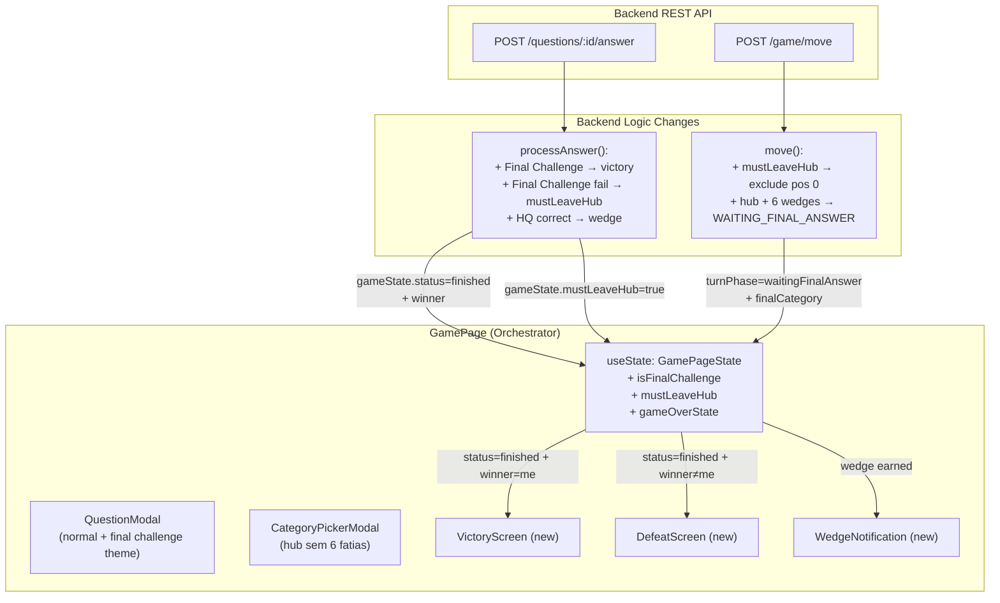
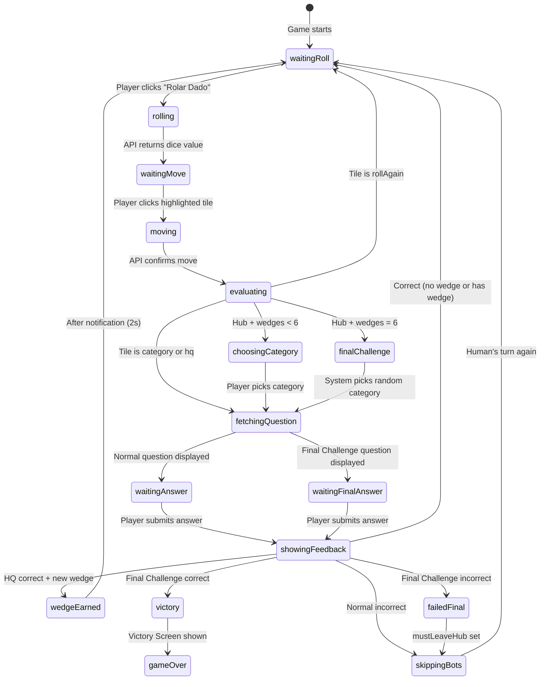

# MVP-5: Fatias e Vitória — Design

**Spec**: `.specs/features/fatias-vitoria/spec.md`
**Status**: Draft

---

## Architecture Overview

MVP-5 adiciona a camada de **progressão e vitória** sobre o fluxo de turno existente (MVP-4). As mudanças são incrementais: o backend `processAnswer` ganha lógica de Desafio Final e vitória; o frontend `GamePage` ganha novos estados (`waitingFinalAnswer`, `won`, `lost`); e componentes visuais novos (`VictoryScreen`, `DefeatScreen`, `WedgeNotification`) são overlays React.

O princípio central é: **backend é fonte da verdade** para wedges, vitória e `mustLeaveHub`. O frontend espelha o estado recebido nas respostas da API e adiciona lógica de apresentação (notificações, telas de fim de jogo, indicadores visuais de fatia no token).



### Extended Turn State Machine



**Novos estados**: `finalChallenge`, `waitingFinalAnswer`, `wedgeEarned`, `victory`, `failedFinal`, `gameOver`. Todos são transientes no frontend; o backend distingue apenas `WAITING_FINAL_ANSWER` (novo) dos outros `TurnPhase` existentes.

---

## Code Reuse Analysis

### Existing Components to Leverage

| Component                     | Location                                                | How to Use                                                                      |
| ----------------------------- | ------------------------------------------------------- | ------------------------------------------------------------------------------- |
| `GameService.processAnswer()` | `backend/src/game/game.service.ts`                      | Extend: add Final Challenge logic, victory, mustLeaveHub                        |
| `GameService.move()`          | `backend/src/game/game.service.ts`                      | Extend: set WAITING_FINAL_ANSWER for hub+6wedges, filter pos 0 for mustLeaveHub |
| `Player` interface            | `backend/src/common/interfaces/player.interface.ts`     | Extend: add `mustLeaveHub: boolean` field                                       |
| `GameState` interface         | `backend/src/common/interfaces/game-state.interface.ts` | Already has `winner` and `status` — no changes needed                           |
| `TurnPhase` enum              | `backend/src/common/enums/turn-phase.enum.ts`           | Extend: add `WAITING_FINAL_ANSWER`                                              |
| `GameStatus` enum             | `backend/src/common/enums/game-status.enum.ts`          | Already has `FINISHED` — no changes needed                                      |
| `QuestionModal`               | `frontend/src/components/QuestionModal.tsx`             | Extend: accept `isFinalChallenge` prop for gold theme                           |
| `CategoryPickerModal`         | `frontend/src/components/CategoryPickerModal.tsx`       | Reuse as-is for hub without 6 wedges                                            |
| `GameHUD`                     | `frontend/src/components/GameHUD.tsx`                   | Extend: add progress hints (P3)                                                 |
| `GamePage`                    | `frontend/src/pages/GamePage.tsx`                       | Extend: add final challenge flow, victory/defeat handling, wedge notification   |
| `game-api.ts`                 | `frontend/src/services/game-api.ts`                     | No changes — existing endpoints suffice                                         |
| `turn-logic.ts`               | `frontend/src/game/turn-logic.ts`                       | Extend: add `getValidDestinationsWithHubExclusion()`                            |
| `types.ts`                    | `frontend/src/game/types.ts`                            | Extend: add new types and GamePageState fields                                  |
| `constants.ts`                | `frontend/src/game/constants.ts`                        | Reuse CATEGORY_COLORS for wedge visuals                                         |
| `TokenRenderer`               | `frontend/src/game/pixi/TokenRenderer.ts`               | Extend: add wedge segments rendering on tokens                                  |
| `QuestionsController`         | `backend/src/questions/questions.controller.ts`         | Extend: support WAITING_FINAL_ANSWER phase check                                |
| `GameController.move()`       | `backend/src/game/game.controller.ts`                   | Extend: return `finalCategory` and `isFinalChallenge` in response               |

### Integration Points

| System                   | Integration Method                                                                                        |
| ------------------------ | --------------------------------------------------------------------------------------------------------- |
| Victory detection        | Backend `processAnswer` sets `status=FINISHED` + `winner`; frontend reads from `AnswerResponse.gameState` |
| mustLeaveHub             | Backend stores on `Player`, filters in `move()`; frontend reads from `MoveResponse`                       |
| Final Challenge category | Backend selects random category in `move()` when hub+6wedges; returns in `MoveResponse`                   |
| Wedge notification       | Frontend detects new wedge by comparing `players.wedges` before/after answer response                     |
| PixiJS wedge segments    | `TokenRenderer` reads `PlayerToken.wedges` and draws pie slices                                           |

---

## Components

### Backend: GameService (modified)

- **Purpose**: Add Final Challenge victory/defeat logic and mustLeaveHub enforcement
- **Location**: `backend/src/game/game.service.ts`
- **Interface changes**:
  - `move()`: When player lands on hub (pos 0) and has 6 wedges → set `turnPhase = WAITING_FINAL_ANSWER`, pick random category, store in `game.finalChallengeCategory`. When `mustLeaveHub = true` → exclude pos 0 from valid destinations. After any move away from hub → reset `mustLeaveHub = false`.
  - `processAnswer()`: When `turnPhase === WAITING_FINAL_ANSWER` and correct → `status = FINISHED`, `winner = player.nickname`. When incorrect → `mustLeaveHub = true`, advance turn.
  - `startGame()`: Initialize `mustLeaveHub = false` for all players.
- **Dependencies**: `BoardConfig`, `GameStateStore`, enums
- **Reuses**: Existing `processAnswer` flow (wedge logic already exists for HQ tiles)

### Backend: GameController (modified)

- **Purpose**: Expose `isFinalChallenge`, `finalCategory`, `mustLeaveHub` in move response; expose `winner` in answer response
- **Location**: `backend/src/game/game.controller.ts`
- **Interface changes**:
  - `move()` response adds: `isFinalChallenge: boolean`, `finalCategory: string | null`
  - Answer response already includes `gameState.status` and `gameState.players` — add `winner: string | null`
- **Dependencies**: `GameService`
- **Reuses**: Existing response structure

### Backend: QuestionsController (modified)

- **Purpose**: Allow fetching questions during `WAITING_FINAL_ANSWER` phase
- **Location**: `backend/src/questions/questions.controller.ts`
- **Interface changes**:
  - `getByCategory()`: Accept both `WAITING_ANSWER` and `WAITING_FINAL_ANSWER` as valid phases
- **Dependencies**: `GameService`, `TurnPhase`
- **Reuses**: Existing validation logic

### Frontend: GamePage (modified — orchestrator)

- **Purpose**: Handle Final Challenge flow, victory/defeat detection, wedge notifications
- **Location**: `frontend/src/pages/GamePage.tsx`
- **Interface changes**:
  - `GamePageState` adds: `isFinalChallenge: boolean`, `gameOverState: GameOverState | null`
  - `handleTileClick()`: After `moveToPosition`, detect `isFinalChallenge` from response → fetch question with system-chosen category → show gold-themed QuestionModal
  - `handleAnswer()`: After `submitAnswer`, check `gameState.status === 'finished'` → set `gameOverState`. Detect wedge changes → show `WedgeNotification`.
  - Derived: `gameOverState !== null` → render VictoryScreen or DefeatScreen
- **Dependencies**: All existing + `VictoryScreen`, `DefeatScreen`, `WedgeNotification`
- **Reuses**: Existing handler patterns, `buildPlayerTokens`, `sleep`, `showNotification`

### Frontend: QuestionModal (modified)

- **Purpose**: Support Final Challenge visual theme
- **Location**: `frontend/src/components/QuestionModal.tsx`
- **Interface changes**:
  - New prop: `isFinalChallenge?: boolean`
  - When `isFinalChallenge = true`: header shows "🏆 DESAFIO FINAL", border/glow in gold (`#FFD700`), category header still shows selected category name
- **Dependencies**: Existing + new prop
- **Reuses**: Entire existing component, only adds conditional styling

### Frontend: VictoryScreen (new)

- **Purpose**: Full-screen overlay celebrating the player's win
- **Location**: `frontend/src/components/VictoryScreen.tsx`
- **Interfaces**:
  - Props: `nickname: string`, `wedges: string[]`, `onPlayAgain: () => void`
  - Renders: semi-transparent overlay, congratulations message "Parabéns, {nickname}! Você venceu!", 6 colored wedge icons (filled), "Jogar Novamente" button
  - "Jogar Novamente" calls `onPlayAgain` → navigates to `/start`
- **Dependencies**: `constants.ts` (CATEGORY_COLORS, CATEGORY_NAMES), `react-router-dom`
- **Reuses**: Styling consistent with QuestionModal overlay pattern

### Frontend: DefeatScreen (new)

- **Purpose**: Full-screen overlay when an opponent wins
- **Location**: `frontend/src/components/DefeatScreen.tsx`
- **Interfaces**:
  - Props: `winnerNickname: string`, `winnerWedges: string[]`, `onPlayAgain: () => void`
  - Renders: semi-transparent overlay, defeat message "{winner} venceu a partida!", winner's wedges, "Jogar Novamente" button
- **Dependencies**: `constants.ts`, `react-router-dom`
- **Reuses**: Same overlay pattern as VictoryScreen

### Frontend: WedgeNotification (new)

- **Purpose**: Toast notification when a wedge is earned
- **Location**: `frontend/src/components/WedgeNotification.tsx`
- **Interfaces**:
  - Props: `category: string | null`, `onDismiss: () => void`
  - When `category !== null`: shows banner "Fatia de {categoryName} conquistada! 🎉" with category color background
  - Auto-dismisses after 2000ms via `useEffect` + `setTimeout`
  - `category === null` → renders nothing
- **Dependencies**: `constants.ts` (CATEGORY_COLORS, CATEGORY_NAMES)
- **Reuses**: Similar pattern to `TurnNotification`

### Frontend: GameHUD (modified — P3 progress hints)

- **Purpose**: Add progress hints for Final Challenge readiness
- **Location**: `frontend/src/components/GameHUD.tsx`
- **Interface changes**:
  - Compute human player's wedge count from `playerWedges`
  - At 5 wedges: show hint "Falta 1 fatia! Conquiste e volte ao Hub Central."
  - At 6 wedges: show hint "Todas as fatias! Vá ao Hub Central para o Desafio Final."
- **Dependencies**: Existing props already include `playerWedges`
- **Reuses**: Existing HUD structure

### Frontend: TokenRenderer (modified — P2 wedge segments)

- **Purpose**: Draw colored pie slices on tokens to represent collected wedges
- **Location**: `frontend/src/game/pixi/TokenRenderer.ts`
- **Interface changes**:
  - `renderTokens()` accepts `PlayerToken[]` extended with `wedges: string[]`
  - For each token with wedges: draw small pie slices (arcs) around the token circle. Each wedge is a 60° arc segment in the category color, drawn as a filled arc inside/behind the main token circle.
  - Uses `Graphics.arc()` with category hex colors from a PixiJS-friendly constant map.
  - 0 wedges → no arcs (just the plain token). 6 wedges → complete colored ring.
- **Dependencies**: Category color hex values (numeric format for PixiJS)
- **Reuses**: Existing `renderTokens` flow — wedge arcs added after main circle

### Frontend: turn-logic.ts (modified)

- **Purpose**: Add hub exclusion for mustLeaveHub
- **Location**: `frontend/src/game/turn-logic.ts`
- **Interface changes**:
  - New function: `filterHubIfMustLeave(destinations: number[], mustLeaveHub: boolean): number[]` — filters out position 0 if `mustLeaveHub` is true
- **Dependencies**: None
- **Reuses**: Existing module

### Frontend: types.ts (modified)

- **Purpose**: Add new types for MVP-5 flows
- **Location**: `frontend/src/game/types.ts`
- **Interface changes**: See Data Models section below
- **Reuses**: Existing type definitions

---

## Data Models

### Backend: Player interface (modified)

```typescript
// backend/src/common/interfaces/player.interface.ts
export interface Player {
  nickname: string;
  position: number;
  wedges: Category[];
  isHuman: boolean;
  mustLeaveHub: boolean; // NEW: set true after failed Final Challenge
}
```

### Backend: GameState interface (modified)

```typescript
// backend/src/common/interfaces/game-state.interface.ts
export interface GameState {
  gameId: string;
  players: Player[];
  currentPlayerIndex: number;
  status: GameStatus;
  turnPhase: TurnPhase;
  lastDiceRoll: number | null;
  activeQuestionId: string | null;
  winner: string | null;
  finalChallengeCategory: string | null; // NEW: system-chosen category for Final Challenge
}
```

### Backend: TurnPhase enum (modified)

```typescript
// backend/src/common/enums/turn-phase.enum.ts
export enum TurnPhase {
  WAITING_ROLL = 'waitingRoll',
  WAITING_MOVE = 'waitingMove',
  WAITING_ANSWER = 'waitingAnswer',
  WAITING_FINAL_ANSWER = 'waitingFinalAnswer', // NEW
}
```

### Frontend: New/Modified Types (`frontend/src/game/types.ts`)

```typescript
// TurnPhase — add final answer phase
type TurnPhase = 'waitingRoll' | 'waitingMove' | 'waitingAnswer' | 'waitingFinalAnswer';

// Game over state for victory/defeat screens
interface GameOverState {
  type: 'victory' | 'defeat';
  winnerNickname: string;
  winnerWedges: string[];
}

// PlayerToken — extend with wedges for PixiJS rendering
interface PlayerToken {
  nickname: string;
  position: number;
  color: PlayerColor;
  isHuman: boolean;
  wedges: string[]; // NEW: for wedge segment rendering on token
}

// MoveResponse — extend with Final Challenge info
interface MoveResponse {
  gameId: string;
  players: PlayerData[];
  currentPlayer: string;
  status: string;
  turnPhase: TurnPhase;
  lastDiceRoll: number | null;
  tileType: TileType;
  tileCategory: Category | null;
  isFinalChallenge: boolean; // NEW
  finalCategory: string | null; // NEW: system-chosen category
}

// AnswerResponse — extend with winner
interface AnswerResponse {
  correct: boolean;
  correctAnswer: string;
  gameState: {
    gameId: string;
    players: PlayerData[];
    currentPlayer: string;
    turnPhase: TurnPhase;
    status: string;
    winner: string | null; // NEW
  };
}

// GamePageState — extend with MVP-5 fields
interface GamePageState {
  // ... existing fields ...
  isFinalChallenge: boolean; // NEW: true during Final Challenge flow
  gameOverState: GameOverState | null; // NEW: non-null when game ended
  earnedWedgeCategory: string | null; // NEW: triggers WedgeNotification
}
```

---

## Key Logic Flows

### Flow 1: Wedge Earned on HQ Tile

```
1. Player lands on HQ tile (e.g., position 5 = Geography HQ)
2. Backend move()  → turnPhase = WAITING_ANSWER (existing)
3. Frontend fetches question → QuestionModal shown (existing)
4. Player answers correctly
5. Backend processAnswer():
   a. tile.type === HQ && tile.category && !player.wedges.includes(category)
   b. Push category to player.wedges (EXISTING LOGIC — already implemented)
   c. turnPhase = WAITING_ROLL
6. Frontend handleAnswer():
   a. Compare players.wedges before/after response
   b. New wedge detected → set earnedWedgeCategory = category
   c. WedgeNotification shows "Fatia de Geografia conquistada! 🎉"
   d. After 2s → dismiss notification, continue turn
```

### Flow 2: Hub Central without 6 Wedges (existing — no changes needed)

```
1. Player lands on Hub (position 0) with < 6 wedges
2. Backend move() → turnPhase = WAITING_ANSWER (existing)
3. Frontend evaluates tileType = 'hub' → shows CategoryPickerModal (EXISTING)
4. Player picks category → fetch question → answer (EXISTING FLOW)
5. No wedge earned (hub is not HQ) — turn continues or ends normally
```

### Flow 3: Hub Central with 6 Wedges — Final Challenge

```
1. Player lands on Hub (position 0) with 6 wedges
2. Backend move():
   a. Detects player.wedges.length === 6 && position === 0
   b. Picks random category: CATEGORY_CYCLE[Math.floor(Math.random() * 6)]
   c. Sets game.finalChallengeCategory = picked category
   d. Sets turnPhase = WAITING_FINAL_ANSWER
3. Backend response includes: isFinalChallenge=true, finalCategory="history"
4. Frontend handleTileClick():
   a. Detects isFinalChallenge from response
   b. Shows notification "🏆 Desafio Final! Categoria: História"
   c. Fetches question for the system-chosen category
   d. Shows QuestionModal with isFinalChallenge=true (gold theme)
5a. Player answers correctly:
   a. Backend processAnswer(): status=FINISHED, winner=player.nickname
   b. Frontend: sets gameOverState = { type: 'victory', ... }
   c. VictoryScreen overlay shown
5b. Player answers incorrectly:
   a. Backend processAnswer(): mustLeaveHub=true, advance turn
   b. Frontend: shows "Incorreto! Você deve sair do Hub." feedback
   c. Turn ends, bot skip sequence, next human turn
```

### Flow 4: mustLeaveHub Enforcement

```
1. Player failed Final Challenge → mustLeaveHub = true (backend)
2. Next turn, player rolls dice
3. Backend rollDice() — no change needed (normal roll)
4. Frontend computes valid destinations
   a. getValidDestinations(0, diceValue) returns [diceValue] (from hub)
   b. filterHubIfMustLeave([diceValue], true) — pos 0 not in results anyway
      (from hub, destinations are always ring positions 1-6, never 0)
5. Player moves to a ring position
6. Backend move():
   a. currentPlayer.position changes from 0 to new position
   b. Detects player was on hub (position was 0) and mustLeaveHub is true
   c. Resets mustLeaveHub = false
7. Player can return to hub in future turns → Final Challenge triggers again
```

### Flow 5: Victory → Victory Screen

```
1. processAnswer returns status='finished', winner=humanNickname
2. Frontend handleAnswer():
   a. Detects gameState.status === 'finished'
   b. Finds winner in players array
   c. Sets gameOverState = { type: 'victory', winnerNickname, winnerWedges }
3. GamePage renders VictoryScreen overlay
4. Board + HUD visible but non-interactive behind overlay
5. "Jogar Novamente" → navigate('/start')
```

### Flow 6: Defeat (future MVP-6 readiness)

```
1. gameState.status === 'finished' && winner !== humanNickname
2. Frontend sets gameOverState = { type: 'defeat', winnerNickname, winnerWedges }
3. DefeatScreen overlay shown
4. "Jogar Novamente" → navigate('/start')
```

---

## API Changes Summary

### POST /game/move — Response Enhancement

```typescript
// Added fields:
{
  // ... existing fields ...
  isFinalChallenge: boolean; // true when hub + 6 wedges
  finalCategory: string | null; // system-chosen category for Final Challenge
}
```

### POST /questions/:id/answer — Response Enhancement

```typescript
// Added field in gameState:
{
  // ... existing fields ...
  gameState: {
    // ... existing fields ...
    winner: string | null; // non-null when game is finished
  }
}
```

### GET /questions/:category — No changes

Existing endpoint works as-is. Phase validation expanded to include `WAITING_FINAL_ANSWER`.

---

## PixiJS Wedge Visualization (P2)

### Token Wedge Segments

Each player token displays wedge progress as colored arc segments around the token:

```
Token radius: 8px (TOKEN_RADIUS, scaled)
Wedge ring: drawn as arcs at radius - 1px to radius + 3px (ring around token)
Each wedge: 60° arc (360° / 6 categories)
Category order: geography, entertainment, history, art, science, sports
Arc start angles: 0°, 60°, 120°, 180°, 240°, 300° (starting from top)
```

**Implementation approach**: In `renderTokens()`, after drawing the main circle, iterate over the player's wedges array and draw filled arcs using `Graphics.arc()`. Each arc uses the category's hex color. The arcs form a ring around the outer edge of the token.

**Category-to-arc mapping** (fixed order for consistency):

| Slot | Category      | Start Angle | End Angle | Color   |
| ---- | ------------- | ----------- | --------- | ------- |
| 0    | Geography     | -90°        | -30°      | #4FC3F7 |
| 1    | Entertainment | -30°        | 30°       | #F48FB1 |
| 2    | History       | 30°         | 90°       | #FFF176 |
| 3    | Art           | 90°         | 150°      | #CE93D8 |
| 4    | Science       | 150°        | 210°      | #81C784 |
| 5    | Sports        | 210°        | 270°      | #FFB74D |

---

## Error Handling Strategy

| Error Scenario                                                      | Handling                                                         | User Impact                                               |
| ------------------------------------------------------------------- | ---------------------------------------------------------------- | --------------------------------------------------------- |
| processAnswer fails during Final Challenge                          | Backend rolls back (no state change), returns error              | Frontend shows error notification, stays in current phase |
| Move to hub with mustLeaveHub (impossible in practice — see AD-022) | Backend validates position 0 is excluded from valid destinations | API returns 400, frontend showed no valid pos 0 anyway    |
| Game already finished, player tries action                          | Backend checks `status !== FINISHED` at start of rollDice/move   | API returns 400 "Game is finished"                        |
| Network error during Final Challenge answer                         | Frontend catches, resets isLoading                               | Player can re-submit (activeQuestionId still set)         |

---

## Tech Decisions

| Decision                                              | Choice                                                                 | Rationale                                                                                  |
| ----------------------------------------------------- | ---------------------------------------------------------------------- | ------------------------------------------------------------------------------------------ |
| AD-024: New TurnPhase for Final Challenge             | `WAITING_FINAL_ANSWER` enum value                                      | Explicit state machine — avoids checking wedges+position on every answer                   |
| AD-022: mustLeaveHub filtering                        | Filter pos 0 in backend `move()` valid destinations                    | Hub exit always goes to ring (1-6), so filtering is redundant in practice, but adds safety |
| AD-023: Defeat screen ready but dormant               | Build DefeatScreen now, triggers on `winner !== human`                 | Zero rework in MVP-6 when bots can win                                                     |
| Wedge diff detection on frontend                      | Compare `players.wedges.length` before/after answer response           | Simple, reliable — no extra backend field needed                                           |
| Random category via `Math.random()`                   | Backend picks category in `move()`, stores in `finalChallengeCategory` | Per AD-002/S4 — system chooses, not player                                                 |
| Gold theme via prop, not new component                | `QuestionModal` accepts `isFinalChallenge` prop                        | Reuse > duplication — only styling differs                                                 |
| VictoryScreen and DefeatScreen as separate components | New files, not merged into one                                         | Clearer separation of concerns; different messages, different styling                      |
| Wedge ring on token (P2) vs HUD only (P1)             | Both — HUD is P1, token ring is P2                                     | HUD is essential info; token ring is visual enhancement                                    |
| `finalChallengeCategory` stored in GameState          | New field on backend `GameState` interface                             | Needed for question fetch — frontend needs to know which category to request               |
| PlayerToken extended with wedges                      | Add `wedges: string[]` to frontend `PlayerToken` type                  | TokenRenderer needs wedge data for PixiJS rendering                                        |
