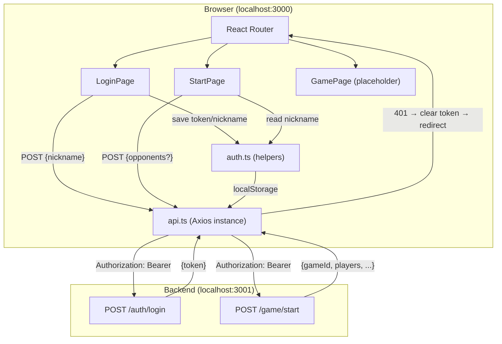

# Frontend Base — Design

**Spec**: `.specs/features/frontend-base/spec.md`
**Status**: Draft

---

## Architecture Overview

SPA React com Vite, React Router (client-side routing) e Axios como HTTP client. A aplicação consome a REST API do backend NestJS (porta 3001). Autenticação via JWT armazenado em localStorage, com interceptors Axios para injeção automática do token e redirect em 401.



### Fluxo Principal

1. Player acessa `/login` → digita apelido → `POST /auth/login` → recebe `{ token }` → salva em localStorage → redirect `/start`
2. Player em `/start` → vê welcome com nickname → clica "Iniciar Jogo" → `POST /game/start` → redirect `/game`
3. Player em `/game` → vê placeholder (tabuleiro virá no MVP-3)
4. Qualquer 401 → interceptor limpa token → redirect `/login`
5. Rotas protegidas (`/start`, `/game`) checam token via `<ProtectedRoute>` wrapper

---

## Code Reuse Analysis

### Existing Components to Leverage

| Component         | Location                                  | How to Use                                     |
| ----------------- | ----------------------------------------- | ---------------------------------------------- |
| LoginDto          | `backend/src/auth/dto/login.dto.ts`       | Mirror validation rules client-side (1-30 chars, não só whitespace) |
| StartGameDto      | `backend/src/game/dto/start-game.dto.ts`  | Know that `opponents` is optional, default 3   |
| Player interface  | `backend/src/common/interfaces/player.interface.ts` | Mirror type for game state display       |
| GameState interface | `backend/src/common/interfaces/game-state.interface.ts` | Mirror type for future-proofing      |
| CORS config       | `backend/src/main.ts`                     | Frontend must run on port 3000 (default CORS origin) |
| JWT payload       | `backend/src/auth/strategies/jwt.strategy.ts` | Payload is `{ nickname: string }` — no user ID |

### Integration Points — Backend API Contracts

| Endpoint            | Method | Auth | Request Body                        | Success Response                                                                                   | Error Responses             |
| ------------------- | ------ | ---- | ----------------------------------- | -------------------------------------------------------------------------------------------------- | --------------------------- |
| `/auth/login`       | POST   | No   | `{ "nickname": string }`            | `201 { "token": string }`                                                                         | `400` (validation)          |
| `/game/start`       | POST   | JWT  | `{ "opponents"?: number }` (opt)    | `201 { gameId, players[], currentPlayer, status, turnPhase, lastDiceRoll }`                        | `400` (game already exists) |

### New Frontend Types (mirroring backend)

```typescript
// Espelho das interfaces backend, simplificado para o que o frontend precisa no MVP-2
interface LoginResponse {
  token: string;
}

interface PlayerSummary {
  nickname: string;
  position: number;
  wedges: string[];
  isHuman: boolean;
}

interface StartGameResponse {
  gameId: string;
  players: PlayerSummary[];
  currentPlayer: string;
  status: string;
  turnPhase: string;
  lastDiceRoll: number | null;
}
```

---

## Components

### Axios Instance (`api.ts`)

- **Purpose**: Instância Axios centralizada com interceptors para JWT e tratamento de 401
- **Location**: `frontend/src/services/api.ts`
- **Interfaces**:
  - Export default Axios instance com `baseURL` configurado
  - Request interceptor: injeta `Authorization: Bearer <token>` se token existe
  - Response interceptor: detecta 401, limpa localStorage, redireciona para `/login`
- **Dependencies**: `axios`, `auth.ts` (para ler/limpar token)
- **Reuses**: Nenhum (novo)

### Auth Helpers (`auth.ts`)

- **Purpose**: Funções puras para gerenciar token/nickname no localStorage
- **Location**: `frontend/src/services/auth.ts`
- **Interfaces**:
  - `getToken(): string | null` — lê `localStorage.getItem('token')`
  - `setToken(token: string): void` — salva token
  - `removeToken(): void` — remove token
  - `getNickname(): string | null` — lê nickname
  - `setNickname(nickname: string): void` — salva nickname
  - `isAuthenticated(): boolean` — retorna `!!getToken()`
  - `clearAuth(): void` — remove token + nickname
- **Dependencies**: Nenhuma (puro localStorage)
- **Reuses**: Nenhum (novo)

### ProtectedRoute (`ProtectedRoute.tsx`)

- **Purpose**: HOC/wrapper que verifica autenticação e redireciona para `/login` se ausente
- **Location**: `frontend/src/components/ProtectedRoute.tsx`
- **Interfaces**:
  - `<ProtectedRoute>` — wraps `<Outlet />`, checa `isAuthenticated()`
  - Se não autenticado → `<Navigate to="/login" replace />`
- **Dependencies**: `auth.ts`, `react-router-dom`
- **Reuses**: Nenhum (novo)

### Router (`App.tsx`)

- **Purpose**: Definição de rotas com React Router v6
- **Location**: `frontend/src/App.tsx`
- **Interfaces**:
  - `/login` → `<LoginPage />` (público)
  - `/start` → `<ProtectedRoute>` → `<StartPage />`
  - `/game` → `<ProtectedRoute>` → `<GamePage />`
  - `/` → redirect para `/start`
  - `*` → redirect para `/start`
- **Dependencies**: `react-router-dom`, `ProtectedRoute`, todas as pages
- **Reuses**: Nenhum (novo)

### LoginPage (`LoginPage.tsx`)

- **Purpose**: Formulário de login com campo de apelido, validação client-side e integração com API
- **Location**: `frontend/src/pages/LoginPage.tsx`
- **Interfaces**:
  - State: `nickname: string`, `error: string`, `loading: boolean`
  - `handleSubmit()`: valida → `POST /auth/login` → salva token/nickname → navigate `/start`
  - Validação: não-vazio, não-whitespace-only, max 30 chars (espelha `LoginDto` do backend)
  - Se já autenticado ao montar → navigate `/start`
- **Dependencies**: `api.ts`, `auth.ts`, `react-router-dom`
- **Reuses**: Validações espelham `LoginDto` do backend

### StartPage (`StartPage.tsx`)

- **Purpose**: Tela de boas-vindas com botão para iniciar partida
- **Location**: `frontend/src/pages/StartPage.tsx`
- **Interfaces**:
  - State: `error: string`, `loading: boolean`
  - Exibe: `"Bem-vindo, {nickname}!"` + botão `"Iniciar Jogo"`
  - `handleStart()`: `POST /game/start` (sem body, usa default 3 oponentes) → navigate `/game`
  - Botão desabilitado durante loading (previne double-click)
- **Dependencies**: `api.ts`, `auth.ts`, `react-router-dom`
- **Reuses**: Nenhum (novo)

### GamePage (`GamePage.tsx`)

- **Purpose**: Placeholder para a tela de jogo (será substituída no MVP-3)
- **Location**: `frontend/src/pages/GamePage.tsx`
- **Interfaces**:
  - Exibe: `"Jogo iniciado! O tabuleiro será renderizado em breve."`
  - Exibe nickname do jogador
- **Dependencies**: `auth.ts`
- **Reuses**: Nenhum (novo)

---

## Project Structure

```
frontend/
├── index.html
├── package.json
├── tsconfig.json
├── vite.config.ts
├── tailwind.config.js
├── postcss.config.js
├── .env                        # VITE_API_URL=http://localhost:3001
├── src/
│   ├── main.tsx                # ReactDOM.createRoot + BrowserRouter
│   ├── App.tsx                 # Routes definition
│   ├── index.css               # Tailwind directives (@tailwind base/components/utilities)
│   ├── services/
│   │   ├── api.ts              # Axios instance + interceptors
│   │   └── auth.ts             # localStorage helpers
│   ├── components/
│   │   └── ProtectedRoute.tsx  # Auth guard wrapper
│   └── pages/
│       ├── LoginPage.tsx       # Login form
│       ├── StartPage.tsx       # Start game screen
│       └── GamePage.tsx        # Placeholder
```

---

## Error Handling Strategy

| Error Scenario                  | Handling                                       | User Impact                                          |
| ------------------------------- | ---------------------------------------------- | ---------------------------------------------------- |
| Validation fail (empty/long)    | Client-side check before API call              | Inline error message below input (red text)          |
| API 400 (bad request)           | Catch in component, extract message            | Error message displayed on form                      |
| API 401 (unauthorized)          | Axios response interceptor                     | Token cleared, redirect to `/login`                  |
| API 500 (server error)          | Catch in component                             | Generic error message on screen                      |
| Network error (ECONNREFUSED)    | Axios interceptor or catch                     | "Erro de conexão com o servidor" message             |
| 401 on login endpoint           | Interceptor skips redirect for login URL       | Normal error handling (not infinite loop)             |
| Double-click on submit          | Button disabled during loading state           | No action (button grayed out)                        |
| Token cleared mid-session       | Next API call → 401 → interceptor → redirect   | Redirect to `/login`                                 |

### 401 Infinite Loop Prevention

O interceptor de response verifica se a request que gerou 401 é para o endpoint `/auth/login`. Se for, **não** faz redirect — apenas propaga o erro normalmente. Isso evita loop infinito: login → 401 → redirect /login → login → 401...

---

## Tech Decisions

| Decision                        | Choice                          | Rationale                                                    |
| ------------------------------- | ------------------------------- | ------------------------------------------------------------ |
| Bundler                         | Vite                            | Padrão moderno React, HMR rápido, configuração mínima (PROJECT.md) |
| Styling                         | Tailwind CSS v3                 | Definido no PROJECT.md, utility-first, sem CSS custom complexo |
| Routing                         | React Router v6                 | Definido no PROJECT.md, routing padrão React SPA              |
| HTTP client                     | Axios                           | Definido no PROJECT.md, interceptors nativos simplificam JWT  |
| Token storage                   | localStorage                    | AD-003: persiste entre abas, projeto local-only               |
| State management                | React useState (local)          | Sem necessidade de estado global no MVP-2; apenas 3 telas simples |
| Form handling                   | Controlled inputs (useState)    | Formulário simples (1 campo); lib de forms é overkill         |
| Port frontend                   | 3000                            | Backend CORS configurado para `http://localhost:3000`         |
| API base URL                    | `VITE_API_URL` env var          | AD-003: default `http://localhost:3001`, configurável         |
| TypeScript                      | Sim (strict mode)               | Coerência com backend TS, type safety                         |
| Redirect strategy (401)         | Axios response interceptor + `window.location` | Funciona independente do React Router context |
| Navigate inside components      | `useNavigate()` hook            | Padrão React Router v6 para navegação programática            |
| Opponents count                 | Hardcoded default (3)           | AD-003: seleção de oponentes adiada para MVP-4               |

---

## Requirement Traceability

| Requirement | Component(s)              | How Addressed                                             |
| ----------- | ------------------------- | --------------------------------------------------------- |
| FRONT-01    | LoginPage                 | Centered form with nickname input + submit button         |
| FRONT-02    | LoginPage, api.ts         | `POST /auth/login` with `{ nickname }` on submit          |
| FRONT-03    | LoginPage, auth.ts        | `setToken(response.token)` on success                     |
| FRONT-04    | LoginPage                 | Client-side validation: non-empty, non-whitespace, max 30 |
| FRONT-05    | LoginPage                 | Catch error → display `error` state on form               |
| FRONT-06    | LoginPage                 | `useEffect` on mount: if `isAuthenticated()` → navigate `/start` |
| FRONT-07    | StartPage, auth.ts        | Welcome message with `getNickname()` + centered button    |
| FRONT-08    | StartPage, api.ts         | `POST /game/start` on button click                        |
| FRONT-09    | StartPage                 | Catch error → display `error` state on screen             |
| FRONT-10    | StartPage                 | `loading` state → button `disabled` + visual feedback     |
| FRONT-11    | App.tsx                   | 3 routes: `/login`, `/start`, `/game`                     |
| FRONT-12    | ProtectedRoute            | Checks `isAuthenticated()` → redirect `/login`            |
| FRONT-13    | App.tsx                   | `/` and `*` → Navigate to `/start`                        |
| FRONT-14    | api.ts (request interceptor) | Adds `Authorization: Bearer <token>` if token exists   |
| FRONT-15    | api.ts (response interceptor) | 401 → `clearAuth()` → redirect `/login`              |
| FRONT-16    | api.ts                    | `baseURL: import.meta.env.VITE_API_URL ?? 'http://localhost:3001'` |
| FRONT-17    | LoginPage, StartPage      | Tailwind: `flex items-center justify-center min-h-screen` + card styling |
| FRONT-18    | LoginPage, StartPage      | Red text for errors, disabled/opacity for loading button  |
| FRONT-19    | index.css, Tailwind config | Dark theme: `bg-gray-900` background, consistent palette |
| FRONT-20    | GamePage                  | Placeholder text + nickname display                       |

**Coverage:** 20/20 requirements mapped ✅
