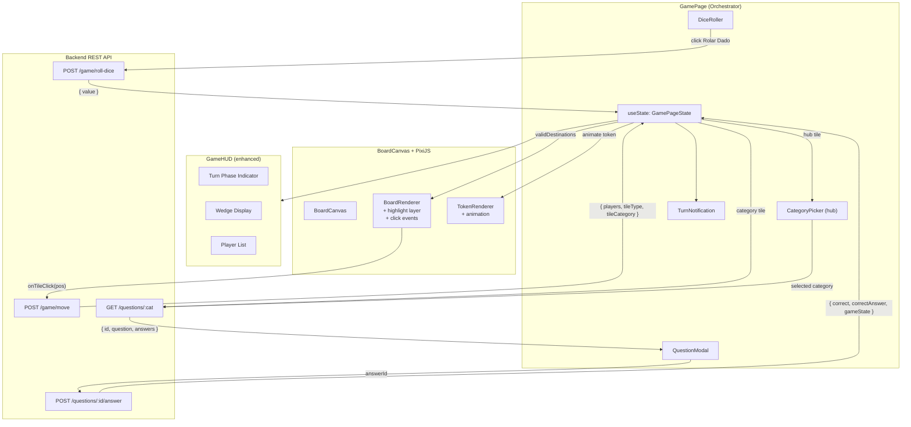
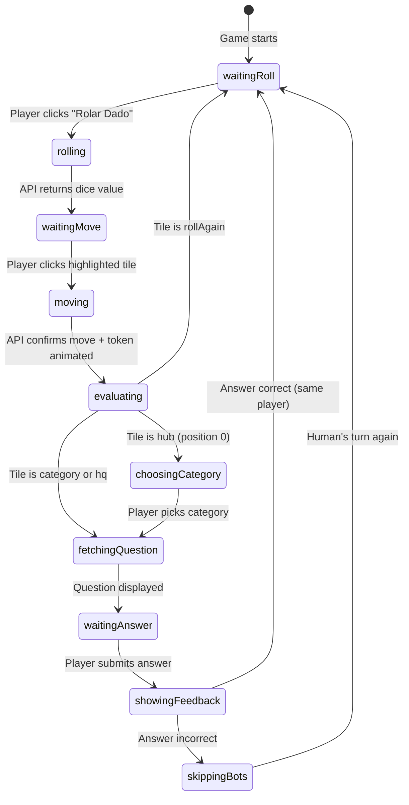

# MVP-4: Lógica de Turno — Design

**Spec**: `.specs/features/logica-turno/spec.md`
**Status**: Draft

---

## Architecture Overview

A lógica de turno transforma o tabuleiro estático (MVP-3) em um jogo interativo. O `GamePage` se torna o **orquestrador central do turno**, mantendo um `useState<GamePageState>` que é atualizado a partir de respostas da API backend. Cada fase do turno (rolar → mover → responder) é exibida por componentes React dedicados, enquanto o PixiJS canvas gerencia destaques de tiles e animação de tokens.

O frontend espelha a lógica de destinos válidos (AD-016) para feedback imediato, e o backend valida toda ação no `POST /game/move`. As fases do turno são gerenciadas otimisticamente no frontend (frontend atualiza turnPhase localmente após cada API call bem-sucedida), com o backend como fonte da verdade.



### Turn State Machine



**Nota**: Os estados intermediários `rolling`, `moving`, `evaluating`, `fetchingQuestion`, `showingFeedback`, e `skippingBots` são transientes (in-flight API calls ou animações). O backend só conhece 3 fases: `waitingRoll`, `waitingMove`, `waitingAnswer` (enum `TurnPhase`). Os estados transientes são gerenciados localmente no frontend para controlar a UI.

---

## Code Reuse Analysis

### Existing Components to Leverage

| Component             | Location                                        | How to Use                                                               |
| --------------------- | ----------------------------------------------- | ------------------------------------------------------------------------ |
| `BoardRenderer`       | `frontend/src/game/pixi/BoardRenderer.ts`       | Extend: add highlight layer, tile click detection (interactive Graphics) |
| `TokenRenderer`       | `frontend/src/game/pixi/TokenRenderer.ts`       | Extend: add `animateToken()` method using PixiJS ticker                  |
| `BoardCanvas`         | `frontend/src/components/BoardCanvas.tsx`       | Extend: accept `onTileClick`, `validDestinations` props                  |
| `GameHUD`             | `frontend/src/components/GameHUD.tsx`           | Extend: add turn phase indicator, wedge display                          |
| `GamePage`            | `frontend/src/pages/GamePage.tsx`               | Refactor: lift `GamePageState` to orchestrate turn flow                  |
| `api.ts` (Axios)      | `frontend/src/services/api.ts`                  | Import for all API calls (JWT injection handled)                         |
| `board-data.ts`       | `frontend/src/game/board-data.ts`               | Reuse for tile type/category lookup after move                           |
| `board-layout.ts`     | `frontend/src/game/board-layout.ts`             | Reuse for tile position lookup (animation targets)                       |
| `constants.ts`        | `frontend/src/game/constants.ts`                | Reuse CATEGORY_COLORS for question modal theming                         |
| `types.ts`            | `frontend/src/game/types.ts`                    | Extend with new turn-related types                                       |
| `GameService`         | `backend/src/game/game.service.ts`              | Modify: `advanceTurn` skips bot players                                  |
| `QuestionsController` | `backend/src/questions/questions.controller.ts` | Modify: enhance answer response to include player wedges                 |

### Integration Points

| System               | Integration Method                                                    |
| -------------------- | --------------------------------------------------------------------- |
| Backend turn APIs    | `api.ts` Axios instance → `game-api.ts` wrapper functions             |
| PixiJS interactivity | `Graphics.eventMode = 'static'` + `on('click')` on tile graphics      |
| PixiJS animation     | `app.ticker.add()` for frame-by-frame token interpolation             |
| React ↔ PixiJS       | Callbacks passed via `BoardCanvas` props; PixiJS fires, React handles |
| Turn phase sync      | Frontend tracks `turnPhase` locally, updates from every API response  |

---

## Components

### GamePage (refactored — turn orchestrator)

- **Purpose**: Orquestra o ciclo de turno: gerencia estado, despacha API calls, coordena UI
- **Location**: `frontend/src/pages/GamePage.tsx`
- **Interfaces**:
  - `useState<GamePageState>` — estado completo do turno (ver Data Models)
  - `handleRollDice()` — POST /game/roll-dice → armazena dice value, calcula validDestinations
  - `handleTileClick(position: number)` — POST /game/move → anima token, avalia tile type
  - `handleCategorySelect(category: Category)` — GET /questions/:category → exibe modal
  - `handleAnswer(answerId: string)` — POST /questions/:id/answer → feedback, próximo turno
  - `handleSkipBots()` — mostra nomes dos bots em sequência, habilita "Rolar Dado"
  - Renders: `BoardCanvas`, `GameHUD`, `DiceRoller`, `QuestionModal`, `CategoryPicker`, `TurnNotification`
- **Dependencies**: `game-api.ts`, `turn-logic.ts`, todos os sub-componentes
- **Reuses**: GamePage existente (estrutura de layout, color assignment, location.state)

### DiceRoller (new)

- **Purpose**: Botão "Rolar Dado" + animação de rolagem + exibição do resultado
- **Location**: `frontend/src/components/DiceRoller.tsx`
- **Interfaces**:
  - Props: `onRoll: () => Promise<number>`, `disabled: boolean`, `diceValue: number | null`, `visible: boolean`
  - Internals: `isRolling: boolean` state para controlar animação
  - Ao clicar: chama `onRoll()`, mostra animação de números aleatórios por 500ms, exibe resultado
  - Botão desabilitado durante `isRolling` ou quando `disabled=true`
- **Dependencies**: Nenhuma externa (React + Tailwind)
- **Reuses**: Estilo consistente com botões existentes (Tailwind dark theme)

### QuestionModal (new)

- **Purpose**: Modal overlay com pergunta, 4 alternativas, e feedback visual de acerto/erro
- **Location**: `frontend/src/components/QuestionModal.tsx`
- **Interfaces**:
  - Props: `question: QuestionData`, `category: Category`, `onAnswer: (answerId: string) => void`, `answerResult: AnswerResult | null`, `visible: boolean`
  - Exibe: categoria (nome + cor) no topo, texto da pergunta, 4 botões de resposta
  - `answerResult === null` → botões habilitados, aguardando resposta
  - `answerResult.correct === true` → fundo verde, "Correto!" (exibido 1.5s, depois fecha)
  - `answerResult.correct === false` → fundo vermelho, "Incorreto!", mostra resposta correta (exibido 2s, depois fecha)
  - Overlay semi-transparente sobre o tabuleiro (board visível mas não interativo)
- **Dependencies**: `constants.ts` (CATEGORY_COLORS para tema), `types.ts`
- **Reuses**: CATEGORY_COLORS, CATEGORY_NAMES (extrair do GameHUD para constantes compartilhadas)

### CategoryPickerModal (new)

- **Purpose**: Modal para escolher categoria quando jogador está no Hub Central
- **Location**: `frontend/src/components/CategoryPickerModal.tsx`
- **Interfaces**:
  - Props: `onSelect: (category: Category) => void`, `visible: boolean`
  - Exibe 6 botões coloridos (um por categoria), cada um com nome + cor da categoria
- **Dependencies**: `constants.ts` (CATEGORY_COLORS, CATEGORY_NAMES)
- **Reuses**: Padrão visual similar ao ColorPicker

### TurnNotification (new)

- **Purpose**: Notificações breves na tela ("Role Novamente!", "Sua vez!", "Vez de Bot 1")
- **Location**: `frontend/src/components/TurnNotification.tsx`
- **Interfaces**:
  - Props: `message: string | null`, `duration?: number`
  - Aparece no topo central da tela com fade-in, auto-desaparece após `duration`ms (default 1500ms)
  - `message === null` → nada renderizado
- **Dependencies**: Nenhuma (React + Tailwind)
- **Reuses**: Nenhuma (novo)

### BoardCanvas (enhanced)

- **Purpose**: Container PixiJS — agora suporta cliques em tiles e destaques
- **Location**: `frontend/src/components/BoardCanvas.tsx`
- **Interfaces**:
  - Props adicionais: `onTileClick?: (position: number) => void`, `validDestinations?: number[]`
  - Passa `onTileClick` e `validDestinations` para `BoardRenderer`
  - Quando `validDestinations` muda, chama `boardRenderer.highlightTiles(positions)`
  - Quando volta a `[]`, chama `boardRenderer.clearHighlights()`
  - Expõe `animateToken(nickname, from, to)` via ref imperativo (`useImperativeHandle`)
- **Dependencies**: Existentes + `TokenRenderer.animateToken()`
- **Reuses**: Toda a lógica existente de mount/unmount/resize

### BoardRenderer (enhanced)

- **Purpose**: Adiciona camada de destaque e detecção de clique em tiles
- **Location**: `frontend/src/game/pixi/BoardRenderer.ts`
- **Interfaces**:
  - `private tileGraphics: Map<number, Graphics>` — rastreia Graphics de cada tile
  - `setOnTileClick(callback: (position: number) => void): void` — registra callback de clique
  - `highlightTiles(positions: number[]): void` — adiciona glow pulsante nos tiles indicados
  - `clearHighlights(): void` — remove todos os destaques, desativa interatividade
  - Destaque visual: círculo semi-transparente pulsante (alpha oscilando via ticker) atrás do tile
- **Dependencies**: `pixi.js` (Graphics, Ticker)
- **Reuses**: Estrutura existente de renderização (addChild, container hierarchy)

### TokenRenderer (enhanced)

- **Purpose**: Adiciona animação suave de movimentação de token
- **Location**: `frontend/src/game/pixi/TokenRenderer.ts`
- **Interfaces**:
  - `animateToken(nickname: string, fromPos: number, toPos: number, layout: BoardLayout, onComplete: () => void): void`
  - Usa `app.ticker.add()` para interpolar posição linearmente em ~500ms
  - Mantém referência a Graphics de cada player: `private tokenGraphics: Map<string, Graphics>`
  - Após animação: chama `onComplete()`, token fica na posição final
- **Dependencies**: `pixi.js` (Ticker)
- **Reuses**: Lógica existente de `renderTokens` (offset calculation, colors)

### GameHUD (enhanced)

- **Purpose**: Adiciona indicador de fase do turno e exibição de fatias conquistadas
- **Location**: `frontend/src/components/GameHUD.tsx`
- **Interfaces**:
  - Props adicionais: `turnPhase: TurnPhase`, `diceValue: number | null`
  - Seção "Fase": exibe texto traduzido por turnPhase (`waitingRoll` → "Rolar Dado", `waitingMove` → "Escolher Destino (🎲 X)", `waitingAnswer` → "Responder Pergunta")
  - Seção "Fatias": para cada jogador, mostra dots coloridos representando `wedges[]`
  - Props atualizada: `players` já contém `wedges: string[]` em cada PlayerToken
- **Dependencies**: `constants.ts`, `types.ts`
- **Reuses**: Toda a estrutura existente do HUD

### game-api.ts (new)

- **Purpose**: Funções wrapper para chamadas à API de turno
- **Location**: `frontend/src/services/game-api.ts`
- **Interfaces**:
  - `rollDice(): Promise<RollDiceResponse>` — POST /game/roll-dice
  - `moveToPosition(targetPosition: number): Promise<MoveResponse>` — POST /game/move
  - `fetchQuestion(category: string): Promise<QuestionData>` — GET /questions/:category
  - `submitAnswer(questionId: string, answerId: string): Promise<AnswerResponse>` — POST /questions/:id/answer
- **Dependencies**: `api.ts` (Axios instance)
- **Reuses**: `api.ts` existente (JWT interceptors)

### turn-logic.ts (new)

- **Purpose**: Lógica frontend de cálculo de destinos válidos (espelha backend BoardConfig)
- **Location**: `frontend/src/game/turn-logic.ts`
- **Interfaces**:
  - `getValidDestinations(from: number, diceValue: number): number[]` — mesma lógica de `BoardConfig.getValidDestinations`
  - `getTileInfo(position: number): TileDef` — busca tile em `BOARD_TILES`
  - `isHumanTurn(players: PlayerData[], currentPlayerNickname: string, humanNickname: string): boolean`
  - `getBotsToSkip(players: PlayerData[], currentPlayerIndex: number): string[]` — retorna nomes dos bots entre o player atual e o humano
- **Dependencies**: `board-data.ts` (BOARD_TILES)
- **Reuses**: Lógica idêntica ao `BoardConfig.getValidDestinations` do backend

---

## Data Models

### New Frontend Types (`frontend/src/game/types.ts` — additions)

```typescript
// Turn phase — espelha backend TurnPhase enum values
type TurnPhase = 'waitingRoll' | 'waitingMove' | 'waitingAnswer';

// Player data from backend (extends existing PlayerToken for game state)
interface PlayerData {
  nickname: string;
  position: number;
  wedges: string[]; // category strings
  isHuman: boolean;
}

// Question data as returned by GET /questions/:category (without correctAnswer)
interface QuestionData {
  id: string;
  category: Category;
  question: string;
  answers: { id: string; text: string }[];
}

// Answer result from POST /questions/:id/answer
interface AnswerResult {
  correct: boolean;
  correctAnswer: string;
}
```

### GamePageState (internal to GamePage)

```typescript
interface GamePageState {
  gameId: string;
  players: PlayerData[]; // backend state of all players
  playerTokens: PlayerToken[]; // players with color assignments (for rendering)
  currentPlayerNickname: string;
  turnPhase: TurnPhase;
  lastDiceRoll: number | null;
  validDestinations: number[]; // computed locally after dice roll
  currentTile: TileDef | null; // tile landed on after move
  question: QuestionData | null; // active question being answered
  answerResult: AnswerResult | null; // answer feedback
  notification: string | null; // ephemeral notification text
  showCategoryPicker: boolean; // hub central category selection
  isLoading: boolean; // API call in-flight
}
```

### API Response Types (`frontend/src/services/game-api.ts`)

```typescript
interface RollDiceResponse {
  value: number;
}

interface MoveResponse {
  gameId: string;
  players: PlayerData[];
  currentPlayer: string;
  status: string;
  turnPhase: TurnPhase;
  lastDiceRoll: number | null;
  tileType: TileType;
  tileCategory: Category | null;
}

interface AnswerResponse {
  correct: boolean;
  correctAnswer: string;
  gameState: {
    gameId: string;
    players: PlayerData[]; // enhanced to include full player data
    currentPlayer: string;
    turnPhase: TurnPhase;
    status: string;
  };
}
```

---

## API Interaction Flow per Turn Phase

### Phase 1: Rolar Dado (`waitingRoll`)

```
Frontend                          Backend
   │                                │
   │  [Rolar Dado button enabled]   │
   │  User clicks                   │
   ├──POST /game/roll-dice─────────►│
   │  (JWT auth)                    │ validates: active game, current player,
   │                                │ turnPhase === waitingRoll
   │◄──{ value: 4 }────────────────┤
   │                                │ backend sets turnPhase = waitingMove
   │  Frontend:                     │
   │  1. Dice animation (0.5s)      │
   │  2. Display result "4"         │
   │  3. Compute validDestinations  │
   │     locally (turn-logic.ts)    │
   │  4. Set turnPhase = waitingMove│
   │  5. Pass validDestinations     │
   │     to BoardCanvas             │
   │  6. BoardRenderer highlights   │
   │     valid tiles                │
```

### Phase 2: Selecionar Destino (`waitingMove`)

```
Frontend                          Backend
   │                                │
   │  [Valid tiles highlighted +    │
   │   clickable in PixiJS]         │
   │  User clicks highlighted tile  │
   │                                │
   ├──POST /game/move──────────────►│
   │  { targetPosition: 15 }       │ validates: turnPhase, valid destination
   │                                │ updates player position
   │◄──{ players, tileType: "hq",──┤ sets turnPhase based on tile type
   │     tileCategory: "history",   │
   │     turnPhase, ... }           │
   │                                │
   │  Frontend:                     │
   │  1. Clear highlights           │
   │  2. Animate token to pos 15   │
   │  3. Update players state       │
   │  4. Evaluate tileType:         │
   │     - "rollAgain" → notify +   │
   │       set waitingRoll          │
   │     - "category"/"hq" →       │
   │       fetch question           │
   │     - "hub" → show category    │
   │       picker                   │
```

### Phase 3a: Buscar Pergunta (category/hq tiles)

```
Frontend                          Backend
   │                                │
   │  [Auto-triggered by tile eval] │
   ├──GET /questions/history───────►│
   │  (JWT auth)                    │ validates: turnPhase === waitingAnswer
   │                                │ selects random unused question
   │◄──{ id, category, question,───┤ sets activeQuestionId
   │     answers[] }                │
   │                                │
   │  Frontend:                     │
   │  1. Display QuestionModal      │
   │  2. Show question + 4 answers  │
   │  3. Category color theming     │
```

### Phase 3b: Hub Central (hub tile — preparatório para MVP-5)

```
Frontend                          Backend
   │                                │
   │  [CategoryPickerModal shown]   │
   │  User picks "science"          │
   │                                │
   ├──GET /questions/science───────►│  (same flow as 3a from here)
   │  ...                           │
```

### Phase 4: Responder Pergunta (`waitingAnswer`)

```
Frontend                          Backend
   │                                │
   │  [4 answer buttons enabled]    │
   │  User clicks answer "b"        │
   ├──POST /questions/:id/answer───►│
   │  { answerId: "b" }            │ validates: activeQuestionId matches
   │                                │ checks answer, processes result
   │◄──{ correct: true,────────────┤ if correct: wedge + waitingRoll
   │     correctAnswer: "b",        │ if incorrect: advanceTurn (skips bots)
   │     gameState: { players,      │
   │       currentPlayer,           │
   │       turnPhase } }            │
   │                                │
   │  Frontend:                     │
   │  1. Show feedback (green/red)  │
   │  2. Wait 1.5s (correct)       │
   │     or 2s (incorrect)          │
   │  3. Close modal                │
   │  4. Update state from response │
   │  5a. If correct: same player,  │
   │      waitingRoll               │
   │  5b. If incorrect: show bot    │
   │      skip sequence, then       │
   │      "Sua vez!" for human      │
```

### Bot Turn Skip Sequence (visual only)

```
Frontend (local animation)
   │
   │  Backend already advanced to human player
   │  Frontend knows bot names from player list
   │
   │  Show "Vez de Bot 1" (0.5s)
   │  Show "Vez de Bot 2" (0.5s)
   │  Show "Vez de Bot 3" (0.5s)
   │  Show "Sua vez!" (1s)
   │  Enable "Rolar Dado"
```

---

## Backend Changes

### 1. `advanceTurn` auto-skips bot players (AD-017)

```typescript
// game.service.ts — advanceTurn modification
private advanceTurn(game: GameState): void {
  do {
    game.currentPlayerIndex =
      (game.currentPlayerIndex + 1) % game.players.length;
  } while (!game.players[game.currentPlayerIndex].isHuman);

  game.turnPhase = TurnPhase.WAITING_ROLL;
  game.lastDiceRoll = null;
}
```

**Rationale**: O frontend não executa turnos de bots no MVP-4 (MVP-6 escopo). O backend pula todos os bots e retorna diretamente ao jogador humano. No MVP-6, esta lógica será substituída por simulação de turno de bot.

### 2. Enhance answer response to include full player data

```typescript
// questions.controller.ts — answer method enhancement
return {
  correct: result.correct,
  correctAnswer: result.correctAnswer,
  gameState: {
    gameId: updatedGame.gameId,
    players: updatedGame.players.map((p) => ({
      nickname: p.nickname,
      position: p.position,
      wedges: p.wedges,
      isHuman: p.isHuman,
    })),
    currentPlayer: updatedGame.players[updatedGame.currentPlayerIndex].nickname,
    turnPhase: updatedGame.turnPhase,
    status: updatedGame.status,
  },
};
```

**Rationale**: A resposta atual não inclui `players` completos. O frontend precisa de `wedges` atualizados após acerto em casa HQ. Sem isso, o HUD não consegue exibir novas fatias imediatamente.

---

## Visual Design Specifications

### Dice Roller

- Botão grande centralizado abaixo do tabuleiro (ou no painel lateral)
- Texto "🎲 Rolar Dado" com fundo colorido (tema do jogador)
- Durante animação: número ciclando rapidamente (100ms interval) por 500ms
- Após resultado: número grande destacado (2x font size) por 1s, depois volta ao tamanho normal
- Resultado persiste visível no HUD durante fase waitingMove

### Valid Destination Highlights

- Círculo semi-transparente pulsante (alpha 0.3↔0.7, ciclo de 1s) ao redor de cada tile válido
- Cor: branco ou amarelo claro (#FFEB3B) para contraste com todas as categorias
- Cursor: `pointer` nos tiles destacados
- Tiles não-destacados: nenhuma interatividade, cursor default
- Ao passar mouse sobre tile destacado (hover): alpha fixo 0.8 (visual feedback)

### Token Animation

- Duração: 500ms
- Interpolação linear (lerp) de posição pixel (x,y) entre tile origem e tile destino
- Token animado fica sobre todas as outras camadas durante animação
- Ao completar: re-renderiza tokens na posição final (com offsets de overlap)

### Question Modal

- Overlay escuro (bg-black/60) sobre toda a tela (tabuleiro visível mas escurecido)
- Card centralizado: largura ~500px, bg-gray-800, rounded-2xl
- Topo: barra colorida com nome da categoria (cor da categoria)
- Corpo: texto da pergunta (text-white, text-lg)
- 4 botões de resposta (bg-gray-700, hover:bg-gray-600, rounded-lg, text-left, padding)
- Feedback correto: botão selecionado fica verde (#22C55E), ícone ✓
- Feedback incorreto: botão selecionado fica vermelho (#EF4444), botão correto fica verde
- Timer visual (barra de progresso) do tempo de feedback antes de fechar

### HUD Turn Phase

- Badge no topo do HUD: "🎲 Rolar Dado" / "📍 Escolher Destino (4)" / "❓ Responder"
- Cores distintas por fase: azul (roll), amarelo (move), roxo (answer)

### HUD Wedges

- Abaixo de cada jogador na lista: até 6 dots coloridos (cores das categorias)
- Dot vazio (border only) para categorias não conquistadas — apenas na seção do jogador humano
- Dot preenchido para categorias conquistadas

---

## Component Hierarchy

```
GamePage
├── BoardCanvas
│   ├── BoardRenderer (PixiJS)
│   │   ├── Background
│   │   ├── Spokes
│   │   ├── Hub
│   │   ├── Ring Tiles (now interactive, with highlight layer)
│   │   └── Highlight Layer (pulsing glow on valid destinations)
│   └── TokenRenderer (PixiJS)
│       └── Player Tokens (now with animation)
├── GameHUD (enhanced)
│   ├── Turn Phase Badge
│   ├── Player List (with wedge dots)
│   └── Category Legend
├── DiceRoller (conditional: visible in waitingRoll)
├── QuestionModal (conditional: visible in waitingAnswer)
├── CategoryPickerModal (conditional: visible when hub tile + waitingAnswer)
└── TurnNotification (conditional: visible when notification !== null)
```

---

## New & Modified Files Summary

### New Files

| File                                              | Purpose                                |
| ------------------------------------------------- | -------------------------------------- |
| `frontend/src/components/DiceRoller.tsx`          | Botão + animação de dado               |
| `frontend/src/components/QuestionModal.tsx`       | Modal de pergunta com 4 alternativas   |
| `frontend/src/components/CategoryPickerModal.tsx` | Seletor de categoria para Hub Central  |
| `frontend/src/components/TurnNotification.tsx`    | Notificações breves                    |
| `frontend/src/services/game-api.ts`               | Wrapper functions para API de turno    |
| `frontend/src/game/turn-logic.ts`                 | Cálculo de destinos válidos (frontend) |

### Modified Files

| File                                            | Changes                                                                   |
| ----------------------------------------------- | ------------------------------------------------------------------------- |
| `frontend/src/pages/GamePage.tsx`               | Refactor para orquestrador de turno com GamePageState                     |
| `frontend/src/components/BoardCanvas.tsx`       | Add `onTileClick`, `validDestinations` props, expose animateToken via ref |
| `frontend/src/game/pixi/BoardRenderer.ts`       | Add highlight layer, tile tracking, click events                          |
| `frontend/src/game/pixi/TokenRenderer.ts`       | Add `animateToken()` with ticker interpolation                            |
| `frontend/src/components/GameHUD.tsx`           | Add turn phase badge, wedge dots display                                  |
| `frontend/src/game/types.ts`                    | Add TurnPhase, PlayerData, QuestionData, AnswerResult types               |
| `frontend/src/game/constants.ts`                | Add CATEGORY_NAMES (extract from GameHUD)                                 |
| `backend/src/game/game.service.ts`              | Modify `advanceTurn` to skip bots                                         |
| `backend/src/questions/questions.controller.ts` | Enhance answer response to include full players data                      |

---

## Error Handling Strategy

| Error Scenario                             | Handling                                            | User Impact                                                                              |
| ------------------------------------------ | --------------------------------------------------- | ---------------------------------------------------------------------------------------- |
| roll-dice 400 "Not in rolling phase"       | Catch, show notification, no state change           | "Erro: não é fase de rolagem" (edge case — UI prevents)                                  |
| roll-dice 400 "Not your turn"              | Catch, show notification                            | "Erro: não é sua vez" (edge case)                                                        |
| move 400 "Invalid destination"             | Catch, show notification, keep highlights active    | "Destino inválido — escolha outro" (should not happen if frontend logic mirrors backend) |
| move 400 "Not in moving phase"             | Catch, show notification                            | "Erro: não é fase de movimento"                                                          |
| questions GET 400 "Not in answering phase" | Catch, show notification                            | "Erro ao buscar pergunta"                                                                |
| answer POST 400 "Question not active"      | Catch, show notification                            | "Erro: pergunta expirada"                                                                |
| Network error (any API call)               | Catch, show notification, no state change           | "Erro de conexão — tente novamente"                                                      |
| API 401                                    | Existing interceptor handles (redirect login)       | Redirect to /login                                                                       |
| Double-click prevention                    | `isLoading` state disables all action buttons/tiles | No action possible during API calls                                                      |

---

## Tech Decisions

| Decision                      | Choice                                                        | Rationale                                                                             |
| ----------------------------- | ------------------------------------------------------------- | ------------------------------------------------------------------------------------- |
| Token animation engine        | PixiJS Ticker (built-in)                                      | Já disponível, sem dependência extra (GSAP seria overkill para lerp simples) — AD-015 |
| Valid destination calculation | Frontend-side (mirrors backend)                               | Feedback imediato sem API call extra. Validação final no backend — AD-016             |
| Bot turn handling             | Backend auto-skip in `advanceTurn` + frontend visual sequence | Simples, 1 mudança backend; visual skip é animação local — AD-017                     |
| Game state management         | `useState` em GamePage (local state)                          | Consistente com AD-004/AD-018; GamePage é o único consumidor de game state            |
| Dice component                | React/Tailwind (not PixiJS)                                   | Texto e botão são mais simples em HTML/CSS que em canvas — AD-019                     |
| Question modal                | React overlay (not PixiJS)                                    | Texto, botões, acessibilidade, i18n — tudo melhor em React/HTML — AD-020              |
| Tile interactivity            | PixiJS Graphics eventMode                                     | API nativa do PixiJS v8 para interaction events                                       |
| Highlight effect              | Pulsing alpha via Ticker                                      | Simples, zero dependências, efeito visual claro                                       |
| Feedback timing               | setTimeout (1.5s correct, 2s incorrect)                       | Spec-defined, controlável, simples                                                    |
| Category picker               | Separate modal component                                      | Hub Central é caso especial; componente dedicado evita complexidade no QuestionModal  |
| Backend answer response       | Include full `players[]` with wedges                          | Frontend precisa de wedges atualizados para HUD imediato                              |

---

## Requirement Traceability

| Requirement (Story)                        | Component(s)                  | How Addressed                                              |
| ------------------------------------------ | ----------------------------- | ---------------------------------------------------------- |
| P1: Rolagem de Dado AC-1 (botão visível)   | DiceRoller, GamePage          | DiceRoller visible when turnPhase=waitingRoll + human turn |
| P1: Rolagem de Dado AC-2 (API + animação)  | DiceRoller, game-api.ts       | onRoll calls rollDice(), 500ms number cycling animation    |
| P1: Rolagem de Dado AC-3 (resultado)       | DiceRoller                    | diceValue prop displayed prominently                       |
| P1: Rolagem de Dado AC-4 (disabled)        | DiceRoller                    | disabled prop + isRolling internal state                   |
| P1: Rolagem de Dado AC-5 (transição)       | GamePage                      | handleRollDice computes validDestinations, updates state   |
| P1: Destinos AC-1 (highlight)              | BoardRenderer, BoardCanvas    | highlightTiles(validDestinations) called on state change   |
| P1: Destinos AC-2 (efeito visual)          | BoardRenderer                 | Pulsing glow effect (alpha oscillation)                    |
| P1: Destinos AC-3 (mesma lógica)           | turn-logic.ts                 | getValidDestinations mirrors BoardConfig                   |
| P1: Destinos AC-4 (1 destino)              | GamePage                      | No auto-move; always highlights and waits for click        |
| P1: Destinos AC-5 (não-válidos)            | BoardRenderer                 | Only highlighted tiles get eventMode='static'              |
| P1: Seleção AC-1 (clickable)               | BoardRenderer                 | Interactive tile graphics with cursor=pointer              |
| P1: Seleção AC-2 (API move)                | GamePage, game-api.ts         | handleTileClick calls moveToPosition()                     |
| P1: Seleção AC-3 (animação)                | TokenRenderer                 | animateToken() with ticker interpolation                   |
| P1: Seleção AC-4 (avaliar tile)            | GamePage                      | Reads tileType/tileCategory from MoveResponse              |
| P1: Seleção AC-5 (disable clicks)          | GamePage                      | isLoading disables tile click handler                      |
| P1: Seleção AC-6 (ignore invalid)          | BoardRenderer                 | Only highlighted tiles have event listeners                |
| P1: Avaliação AC-1 (category→question)     | GamePage                      | tileType=category → fetchQuestion(tileCategory)            |
| P1: Avaliação AC-2 (hq→question)           | GamePage                      | tileType=hq → fetchQuestion(tileCategory)                  |
| P1: Avaliação AC-3 (rollAgain)             | GamePage, TurnNotification    | tileType=rollAgain → notify + waitingRoll                  |
| P1: Avaliação AC-4 (hub→picker)            | GamePage, CategoryPickerModal | tileType=hub → showCategoryPicker=true                     |
| P1: Avaliação AC-5 (hub→question)          | GamePage                      | onCategorySelect → fetchQuestion(selected)                 |
| P1: Avaliação AC-6 (rollAgain auto)        | GamePage                      | Set turnPhase=waitingRoll, show DiceRoller                 |
| P1: Modal AC-1 (4 answers)                 | QuestionModal                 | Renders question.answers as 4 buttons                      |
| P1: Modal AC-2 (category color)            | QuestionModal                 | Category name + CATEGORY_COLORS[category] bar              |
| P1: Modal AC-3 (submit answer)             | QuestionModal, game-api.ts    | onAnswer calls submitAnswer()                              |
| P1: Modal AC-4 (correct feedback)          | QuestionModal                 | Green highlight + "Correto!" for 1.5s                      |
| P1: Modal AC-5 (incorrect feedback)        | QuestionModal                 | Red highlight + "Incorreto!" + correct answer for 2s       |
| P1: Modal AC-6 (disable during feedback)   | QuestionModal                 | answerResult !== null → buttons disabled                   |
| P1: Modal AC-7 (disable during API)        | QuestionModal                 | isLoading from GamePage → disabled                         |
| P1: Modal AC-8 (overlay)                   | QuestionModal                 | bg-black/60 overlay, board visible behind                  |
| P1: Continuação AC-1 (correct→waitingRoll) | GamePage                      | If correct: close modal, set waitingRoll, same player      |
| P1: Continuação AC-2 (incorrect→next)      | GamePage                      | If incorrect: close modal, update from gameState           |
| P1: Continuação AC-3 (bot turn display)    | TurnNotification              | Show bot names in sequence                                 |
| P1: Continuação AC-4 (skip bots)           | game.service.ts (advanceTurn) | Loop skips non-human players                               |
| P1: Continuação AC-5 (human turn)          | TurnNotification, DiceRoller  | "Sua vez!" + enable DiceRoller                             |
| P1: Integração AC-1 (roll sync)            | GamePage                      | Store diceValue, set turnPhase=waitingMove                 |
| P1: Integração AC-2 (move sync)            | GamePage                      | Update all state from MoveResponse                         |
| P1: Integração AC-3 (answer sync)          | GamePage                      | Update from AnswerResponse.gameState                       |
| P1: Integração AC-4 (400 error)            | GamePage (error handlers)     | Show notification, no state change                         |
| P1: Integração AC-5 (currentPlayer)        | GamePage, GameHUD             | Update currentPlayerNickname from responses                |
| P1: Integração AC-6 (frontend mirrors)     | turn-logic.ts                 | getValidDestinations mirrors BoardConfig                   |
| P2: Turn Phase HUD AC-1..3                 | GameHUD                       | Turn phase badge with translated text                      |
| P2: Wedges HUD AC-1..2                     | GameHUD                       | Colored dots per player showing wedges                     |

**Coverage:** All P1 and P2 acceptance criteria mapped ✅
