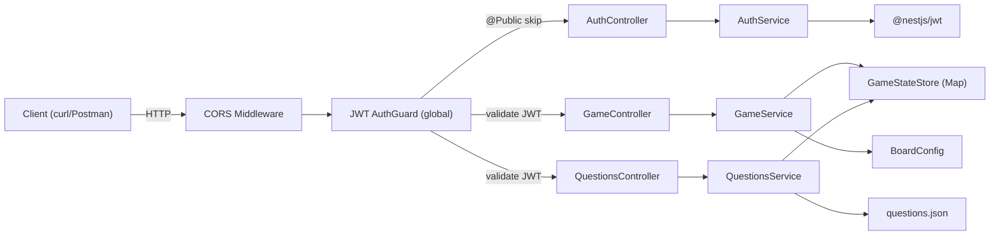
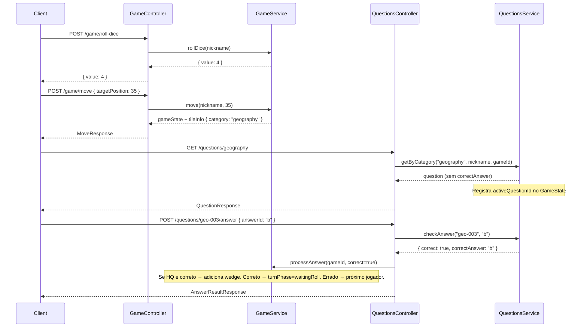

# MVP-1: Backend Base — Design

**Spec**: `.specs/features/mvp-1-backend-base/spec.md`
**Status**: Draft

---

## Architecture Overview

NestJS application com 3 módulos de feature (Auth, Game, Questions) + infraestrutura compartilhada. Todas as rotas protegidas por JWT Guard global, exceto login. Estado em memória via Maps. Perguntas em JSON estático.



### Request Flow

```
Client → CORS → JWT AuthGuard → ValidationPipe (DTO) → Controller → Service → Store/Data
```

1. **CORS** filtra origens (configurável via env `CORS_ORIGIN`)
2. **JWT AuthGuard** valida token em todas as rotas; rotas marcadas com `@Public()` passam sem token
3. **ValidationPipe** valida DTOs via class-validator antes de chegar ao controller
4. **Controller** delega para o **Service** correspondente
5. **Service** manipula estado no **Store** (in-memory) ou busca dados do **JSON**

---

## Project Structure

```
src/
├── main.ts                          # Bootstrap, CORS, ValidationPipe global
├── app.module.ts                    # Root module, imports dos 3 módulos
├── auth/
│   ├── auth.module.ts               # AuthModule (JwtModule, PassportModule)
│   ├── auth.controller.ts           # POST /auth/login
│   ├── auth.service.ts              # Validação de nickname, geração JWT
│   ├── strategies/
│   │   └── jwt.strategy.ts          # Passport JWT strategy
│   ├── guards/
│   │   └── jwt-auth.guard.ts        # Global JWT guard com @Public() bypass
│   ├── decorators/
│   │   ├── public.decorator.ts      # @Public() — marca rota como aberta
│   │   └── current-user.decorator.ts # @CurrentUser() — extrai nickname do JWT
│   └── dto/
│       └── login.dto.ts             # { nickname: string }
├── game/
│   ├── game.module.ts               # GameModule
│   ├── game.controller.ts           # POST /game/start, /game/roll-dice, /game/move
│   ├── game.service.ts              # Lógica de jogo: criar, rolar, mover, turno
│   ├── game-state.store.ts          # In-memory Maps (gameId→state, nickname→gameId)
│   ├── board.config.ts              # Definição estática do tabuleiro (tiles, tipos)
│   └── dto/
│       ├── start-game.dto.ts        # { opponents?: number }
│       └── move.dto.ts              # { targetPosition: number }
├── questions/
│   ├── questions.module.ts          # QuestionsModule
│   ├── questions.controller.ts      # GET /questions/:category, POST /questions/:id/answer
│   ├── questions.service.ts         # Busca, seleção aleatória, verificação de resposta
│   ├── questions.store.ts           # Pool de perguntas em memória + tracking de usadas
│   ├── dto/
│   │   └── answer.dto.ts            # { answerId: string }
│   └── data/
│       └── questions.json           # JSON estático com perguntas (6 categorias)
└── common/
    └── interfaces/
        ├── game-state.interface.ts
        ├── player.interface.ts
        ├── question.interface.ts
        └── board.interface.ts
```

---

## Code Reuse Analysis

### Existing Components to Leverage

Projeto greenfield — não há código existente. A análise foca em padrões NestJS reutilizáveis internamente.

| Padrão                   | Uso                                                              |
| ------------------------ | ---------------------------------------------------------------- |
| Global Guard + Decorator | JWT AuthGuard global com `@Public()` — padrão NestJS documentado |
| ValidationPipe + DTOs    | class-validator em todos os endpoints — reutilizável por módulo  |
| In-memory Store pattern  | GameStateStore e QuestionsStore seguem mesmo padrão de Map       |

### Integration Points

| Sistema          | Método de Integração                                                        |
| ---------------- | --------------------------------------------------------------------------- |
| Frontend (MVP-2) | REST API via HTTP; JWT no header `Authorization: Bearer`                    |
| Game ↔ Questions | GameService chama QuestionsService para linkar pergunta ativa ao game state |

---

## Components

### AuthController

- **Purpose**: Endpoint de login — recebe nickname, retorna JWT
- **Location**: `src/auth/auth.controller.ts`
- **Interfaces**:
  - `POST /auth/login(body: LoginDto): { token: string }` — gera JWT com nickname + exp
- **Dependencies**: AuthService
- **Req IDs**: AUTH-01, AUTH-02

### AuthService

- **Purpose**: Validação de nickname e geração de token JWT
- **Location**: `src/auth/auth.service.ts`
- **Interfaces**:
  - `login(nickname: string): { token: string }` — valida nickname, assina JWT (2h exp)
- **Dependencies**: JwtService (@nestjs/jwt)
- **Req IDs**: AUTH-02, VAL-01

### JwtStrategy

- **Purpose**: Passport strategy que extrai e valida JWT do header Authorization
- **Location**: `src/auth/strategies/jwt.strategy.ts`
- **Interfaces**:
  - `validate(payload: { nickname: string, exp: number }): { nickname: string }` — retorna user data
- **Dependencies**: ConfigService (JWT_SECRET)
- **Req IDs**: AUTH-03

### JwtAuthGuard

- **Purpose**: Guard global que protege todas as rotas; detecta `@Public()` para bypass
- **Location**: `src/auth/guards/jwt-auth.guard.ts`
- **Interfaces**:
  - `canActivate(context: ExecutionContext): boolean` — verifica JWT ou @Public
- **Dependencies**: Reflector (NestJS), JwtStrategy
- **Req IDs**: AUTH-04, AUTH-05

### GameController

- **Purpose**: Endpoints REST do módulo de jogo
- **Location**: `src/game/game.controller.ts`
- **Interfaces**:
  - `POST /game/start(body: StartGameDto, user: string): GameStateResponse` — cria partida
  - `POST /game/roll-dice(user: string): { value: number }` — rola dado 1-6
  - `POST /game/move(body: MoveDto, user: string): GameStateResponse` — move peça
- **Dependencies**: GameService, @CurrentUser()
- **Req IDs**: GAME-01, GAME-03, GAME-05

### GameService

- **Purpose**: Lógica core do jogo — criação de partida, dado, movimentação, controle de turno
- **Location**: `src/game/game.service.ts`
- **Interfaces**:
  - `startGame(nickname: string, opponents: number): GameState` — cria game state com jogadores
  - `rollDice(nickname: string): { value: number }` — gera 1-6, valida turno
  - `move(nickname: string, targetPosition: number): GameState` — valida e atualiza posição
  - `processAnswer(gameId: string, correct: boolean): GameState` — atualiza turno pós-resposta
- **Dependencies**: GameStateStore, BoardConfig
- **Req IDs**: GAME-01 a GAME-06

### GameStateStore

- **Purpose**: Armazena state de todas as partidas ativas em memória
- **Location**: `src/game/game-state.store.ts`
- **Interfaces**:
  - `create(state: GameState): void`
  - `findByGameId(gameId: string): GameState | undefined`
  - `findByNickname(nickname: string): GameState | undefined`
  - `update(gameId: string, state: GameState): void`
  - `delete(gameId: string): void`
- **Dependencies**: Nenhuma (standalone injectable)
- **Storage**: `Map<string, GameState>` (gameId → state) + `Map<string, string>` (nickname → gameId)
- **Req IDs**: GAME-01, GAME-02

### BoardConfig

- **Purpose**: Definição estática do tabuleiro — posições, tipos de casa, categorias
- **Location**: `src/game/board.config.ts`
- **Interfaces**:
  - `getTile(position: number): Tile` — retorna tipo e categoria da casa
  - `getValidDestinations(from: number, diceValue: number): number[]` — destinos alcançáveis (simplificado\*)
  - `isValidPosition(position: number): boolean`
- **Dependencies**: Nenhuma (constantes estáticas)
- **Nota**: \*MVP-1 usa modelo simplificado de tabuleiro (linear/circular sem grafo de adjacência completo). O grafo completo com spokes e escolha de direção pertence ao MVP-4.
- **Req IDs**: GAME-05, GAME-06

### QuestionsController

- **Purpose**: Endpoints de perguntas — busca por categoria e verificação de resposta
- **Location**: `src/questions/questions.controller.ts`
- **Interfaces**:
  - `GET /questions/:category(user: string): QuestionResponse` — pergunta aleatória sem resposta correta
  - `POST /questions/:id/answer(body: AnswerDto, user: string): AnswerResponse` — verifica resposta
- **Dependencies**: QuestionsService, GameService (para atualizar game state pós-resposta)
- **Req IDs**: QUEST-01, QUEST-03

### QuestionsService

- **Purpose**: Carrega perguntas do JSON, seleciona aleatoriamente sem repetição, verifica respostas
- **Location**: `src/questions/questions.service.ts`
- **Interfaces**:
  - `getByCategory(category: Category, nickname: string, gameId: string): Question` — pergunta não repetida
  - `checkAnswer(questionId: string, answerId: string): { correct: boolean, correctAnswer: string }`
  - `getValidCategories(): Category[]`
- **Dependencies**: QuestionsStore
- **Req IDs**: QUEST-01 a QUEST-04

### QuestionsStore

- **Purpose**: Pool de perguntas em memória + tracking de perguntas já usadas por jogador/partida
- **Location**: `src/questions/questions.store.ts`
- **Interfaces**:
  - `loadFromJson(): void` — carrega questions.json no startup
  - `getByCategory(category: Category): Question[]` — todas da categoria
  - `getById(id: string): Question | undefined`
  - `markAsUsed(gameId: string, nickname: string, questionId: string): void`
  - `getUsedIds(gameId: string, nickname: string): Set<string>`
  - `resetCategoryPool(gameId: string, nickname: string, category: Category): void`
- **Dependencies**: Nenhuma (standalone injectable, lê JSON no init)
- **Req IDs**: QUEST-02

---

## Data Models

### Enums

```typescript
enum Category {
  GEOGRAPHY = 'geography',
  ENTERTAINMENT = 'entertainment',
  HISTORY = 'history',
  ART = 'art',
  SCIENCE = 'science',
  SPORTS = 'sports',
}

enum TileType {
  CATEGORY = 'category', // Casa colorida normal
  HQ = 'hq', // Casa de fatia (headquarters)
  ROLL_AGAIN = 'rollAgain', // Rola de novo
  HUB = 'hub', // Hub central
}

enum TurnPhase {
  WAITING_ROLL = 'waitingRoll',
  WAITING_MOVE = 'waitingMove',
  WAITING_ANSWER = 'waitingAnswer',
}

enum GameStatus {
  STARTED = 'started',
  FINISHED = 'finished',
}
```

### Player

```typescript
interface Player {
  nickname: string;
  position: number; // 0 = hub central
  wedges: Category[]; // fatias conquistadas (max 6, sem duplicatas)
  isHuman: boolean;
}
```

### GameState

```typescript
interface GameState {
  gameId: string; // UUID v4
  players: Player[]; // [humano, ...oponentes simulados]
  currentPlayerIndex: number; // índice do jogador ativo
  status: GameStatus;
  turnPhase: TurnPhase;
  lastDiceRoll: number | null; // valor do dado atual (null se não rolou)
  activeQuestionId: string | null; // pergunta ativa (null se não em resposta)
  winner: string | null; // nickname do vencedor (null se em andamento)
}
```

**Relacionamentos**: Player é embedded em GameState. Um jogador (nickname) mapeia para no máximo 1 GameState ativo.

### Tile (Board)

```typescript
interface Tile {
  position: number;
  type: TileType;
  category: Category | null; // null para hub e rollAgain
}
```

### Question

```typescript
interface Question {
  id: string; // ex: "geo-001"
  category: Category;
  question: string; // texto da pergunta
  answers: Answer[]; // sempre 4 alternativas
  correctAnswer: string; // 'a' | 'b' | 'c' | 'd'
}

interface Answer {
  id: string; // 'a' | 'b' | 'c' | 'd'
  text: string;
}
```

### DTOs (Request/Response)

```typescript
// Request DTOs
class LoginDto {
  @IsNotEmpty()
  @IsString()
  @MaxLength(30)
  nickname: string;
}

class StartGameDto {
  @IsOptional()
  @IsInt()
  @Min(1)
  @Max(5)
  opponents?: number = 3;
}

class MoveDto {
  @IsInt()
  targetPosition: number;
}

class AnswerDto {
  @IsIn(['a', 'b', 'c', 'd'])
  answerId: string;
}

// Response types
interface LoginResponse {
  token: string;
}

interface GameStateResponse {
  gameId: string;
  players: PlayerResponse[];
  currentPlayer: string;
  status: GameStatus;
  turnPhase: TurnPhase;
  lastDiceRoll: number | null;
}

interface PlayerResponse {
  nickname: string;
  position: number;
  wedges: Category[];
  isHuman: boolean;
}

interface DiceRollResponse {
  value: number;
}

interface MoveResponse extends GameStateResponse {
  tileType: TileType;
  tileCategory: Category | null;
}

interface QuestionResponse {
  id: string;
  category: Category;
  question: string;
  answers: { id: string; text: string }[];
  // Nota: NÃO inclui correctAnswer
}

interface AnswerResultResponse {
  correct: boolean;
  correctAnswer: string;
}
```

---

## Board Model (Simplificado — MVP-1)

O tabuleiro do Trivial Pursuit tem 42 casas na trilha circular + 6 raios de 5 casas cada + hub central. Para MVP-1, usamos um modelo simplificado:

```
Tabuleiro: 42 posições na trilha circular (1-42)
           + hub central (posição 0)
           + 30 posições nos raios (6 raios × 5 casas)

Total: 73 posições (0-72)
```

### Layout de Posições

```
Posição 0:        Hub Central
Posições 1-5:     Raio 1 (Geografia) — hub → HQ
Posições 6-10:    Raio 2 (Entretenimento) — hub → HQ
Posições 11-15:   Raio 3 (História) — hub → HQ
Posições 16-20:   Raio 4 (Arte) — hub → HQ
Posições 21-25:   Raio 5 (Ciências) — hub → HQ
Posições 26-30:   Raio 6 (Esportes) — hub → HQ
Posições 31-72:   Trilha circular (42 casas entre os HQs)
```

### Casas HQ (posições 5, 10, 15, 20, 25, 30)

Última casa de cada raio. Acerto aqui = ganha fatia da categoria.

### Casas Roll Again

12 casas espalhadas na trilha circular (2 entre cada par de HQs).

### Validação de Movimento (MVP-1)

Para MVP-1, a validação de destinos é **simplificada**:

- O service calcula as posições alcançáveis considerando movimentação linear na trilha circular
- Não implementa escolha de direção ou navegação em spokes (MVP-4)
- `getValidDestinations(from, diceValue)` retorna as posições a exatamente `diceValue` passos de distância no anel circular

> **Nota**: O grafo completo de adjacência (trilha + raios + hub + escolha de direção) será implementado no MVP-4 (Lógica de Turno). O MVP-1 garante que a API funciona end-to-end com movimentação básica.

---

## Fluxo de Integração: Game ↔ Questions

O fluxo de uma jogada completa envolve coordenação entre GameModule e QuestionsModule:



---

## Error Handling Strategy

| Cenário                       | Exception                  | HTTP | Mensagem                                 | Req IDs   |
| ----------------------------- | -------------------------- | ---- | ---------------------------------------- | --------- |
| Nickname vazio/espaços        | BadRequestException        | 400  | "Nickname is required"                   | VAL-01    |
| Nickname > 30 chars           | BadRequestException        | 400  | "Nickname must be at most 30 characters" | VAL-01    |
| JWT ausente                   | UnauthorizedException      | 401  | "Unauthorized"                           | AUTH-04   |
| JWT expirado/malformado       | UnauthorizedException      | 401  | "Unauthorized"                           | AUTH-03   |
| Jogo já em andamento          | BadRequestException        | 400  | "Game already in progress"               | Edge Case |
| Oponentes fora de 1-5         | BadRequestException        | 400  | "Opponents must be between 1 and 5"      | GAME-01   |
| Não é turno do jogador        | BadRequestException        | 400  | "Not your turn"                          | GAME-04   |
| Sem jogo ativo                | BadRequestException        | 400  | "No active game"                         | GAME-03   |
| Já rolou dado neste turno     | BadRequestException        | 400  | "Dice already rolled"                    | GAME-03   |
| Não rolou dado antes de mover | BadRequestException        | 400  | "Roll dice first"                        | GAME-05   |
| Posição inválida              | BadRequestException        | 400  | "Invalid target position"                | GAME-05   |
| Categoria inválida            | BadRequestException        | 400  | "Invalid category. Valid: [...]"         | QUEST-01  |
| Pergunta não encontrada       | NotFoundException          | 404  | "Question not found"                     | QUEST-03  |
| answerId inválido             | BadRequestException        | 400  | "answerId must be one of: a, b, c, d"    | QUEST-03  |
| Pergunta não é a ativa        | BadRequestException        | 400  | "This question is not currently active"  | Edge Case |
| Campos obrigatórios ausentes  | BadRequestException (Pipe) | 400  | Field-specific validation errors         | VAL-02    |

**Estratégia**: Usar HttpExceptions nativas do NestJS. ValidationPipe global cuida de DTOs automaticamente com mensagens descritivas por campo.

---

## Configuration (Environment Variables)

| Variável      | Obrigatória | Default                 | Descrição                         |
| ------------- | ----------- | ----------------------- | --------------------------------- |
| `JWT_SECRET`  | Sim         | —                       | Secret para assinar/verificar JWT |
| `CORS_ORIGIN` | Não         | `http://localhost:5173` | Origem permitida para CORS        |
| `PORT`        | Não         | `3001`                  | Porta do servidor HTTP            |

Usar `@nestjs/config` com `ConfigModule.forRoot()` para carregar variáveis de `.env`.

---

## Tech Decisions

| Decisão                      | Escolha                             | Racional                                                                   |
| ---------------------------- | ----------------------------------- | -------------------------------------------------------------------------- |
| Autenticação                 | @nestjs/jwt + @nestjs/passport      | Padrão NestJS oficial; JwtStrategy integra com Guards nativamente          |
| Validação de input           | class-validator + class-transformer | ValidationPipe global do NestJS; decorators declarativos nos DTOs          |
| Guard global com exceções    | APP_GUARD + @Public() decorator     | Seguro por padrão — toda rota protegida; exceções explícitas via decorator |
| Geração de IDs               | uuid v4                             | Sem banco — uuid garante unicidade sem sequência                           |
| Estado em memória            | Map<string, T>                      | Aceito como limitação (spec); simples, rápido, sem overhead de ORM/DB      |
| Board model MVP-1            | Linear circular (simplificado)      | Grafo completo de adjacência é MVP-4; MVP-1 valida movimentação básica     |
| Nomes de oponentes simulados | Gerados automaticamente             | "Bot 1", "Bot 2", etc. — identificação clara sem config extra              |
| Perguntas JSON               | Carregado em memória no startup     | Arquivo estático; sem hot-reload necessário; pool fica em QuestionsStore   |
| Tracking de perguntas usadas | Map no QuestionsStore               | Vinculado a gameId+nickname; resetado quando pool esgota (per spec)        |

---

## Requirement Coverage

| Req ID   | Componente(s)                            | Status   |
| -------- | ---------------------------------------- | -------- |
| AUTH-01  | AuthController                           | Designed |
| AUTH-02  | AuthService                              | Designed |
| AUTH-03  | JwtStrategy                              | Designed |
| AUTH-04  | JwtAuthGuard                             | Designed |
| AUTH-05  | JwtAuthGuard, ConfigModule               | Designed |
| GAME-01  | GameController, GameService              | Designed |
| GAME-02  | GameService, GameStateStore              | Designed |
| GAME-03  | GameController, GameService              | Designed |
| GAME-04  | GameService                              | Designed |
| GAME-05  | GameController, GameService, BoardConfig | Designed |
| GAME-06  | GameService, BoardConfig                 | Designed |
| QUEST-01 | QuestionsController, QuestionsService    | Designed |
| QUEST-02 | QuestionsService, QuestionsStore         | Designed |
| QUEST-03 | QuestionsController, QuestionsService    | Designed |
| QUEST-04 | QuestionsService, GameService            | Designed |
| VAL-01   | AuthService, LoginDto                    | Designed |
| VAL-02   | ValidationPipe (global), DTOs            | Designed |

**Coverage:** 17/17 requirements mapped to components ✅
