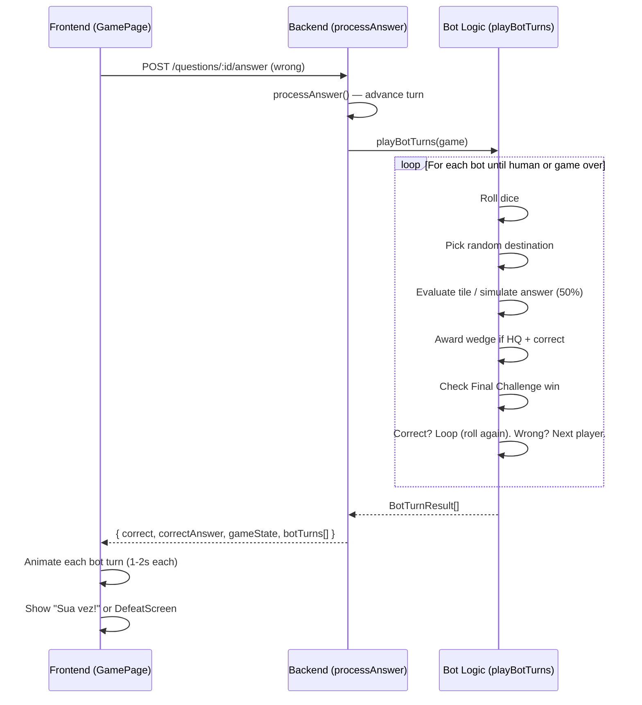

# MVP-6: Oponentes Simulados — Design

**Spec**: `.specs/features/oponentes-simulados/spec.md`
**Status**: Draft

---

## Architecture Overview

Bot turns execute **entirely on the backend** when a human player's turn ends (wrong answer or failed Final Challenge). The backend plays all consecutive bot turns in a loop, collecting results into a `botTurns[]` array returned in the answer response. The frontend animates these results sequentially.

Key principle: **one API call, all bot turns**. No polling, no per-bot API calls.



### Modified Turn State Machine

```
Human answers wrong → advanceTurn (next player, could be bot)
  → playBotTurns() loops:
      Bot: roll → move → evaluate tile:
        rollAgain → roll again (no answer)
        category/hq → 50% answer:
          correct + hq + new category → wedge earned
          correct → bot rolls again (same turn)
          wrong → advance to next player
        hub + <6 wedges → 50% answer:
          correct → bot rolls again
          wrong → advance
        hub + 6 wedges → Final Challenge 50%:
          correct → GAME OVER (bot wins)
          wrong → mustLeaveHub, advance
      Loop max 10 rolls per bot (safety cap)
  → returns array of all bot actions
  → frontend animates sequentially
```

---

## Code Reuse Analysis

### Existing Components to Leverage

| Component                            | Location                                  | How to Use                                                                |
| ------------------------------------ | ----------------------------------------- | ------------------------------------------------------------------------- |
| `GameService.advanceTurn()`          | `backend/src/game/game.service.ts`        | Modify: remove do-while skip, advance one player at a time                |
| `GameService.processAnswer()`        | `backend/src/game/game.service.ts`        | Extend: call playBotTurns after advanceTurn, include botTurns in response |
| `BoardConfig.getValidDestinations()` | `backend/src/game/board.config.ts`        | Reuse: same destination logic for bots                                    |
| `BoardConfig.getTile()`              | `backend/src/game/board.config.ts`        | Reuse: tile evaluation for bot moves                                      |
| `GamePage.runBotSkipSequence()`      | `frontend/src/pages/GamePage.tsx`         | Replace: new `runBotTurnSequence()` with full animation                   |
| `TokenRenderer.animateToken()`       | `frontend/src/game/pixi/TokenRenderer.ts` | Reuse: animate bot token movement                                         |
| `VictoryScreen` / `DefeatScreen`     | `frontend/src/components/`                | Reuse: defeat triggered by bot win                                        |
| `GameHUD` / `WedgeNotification`      | `frontend/src/components/`                | Reuse: show bot wedge progress updates                                    |

### Integration Points

| System                           | Integration Method                                 |
| -------------------------------- | -------------------------------------------------- |
| `processAnswer` response         | Add `botTurns: BotTurnResult[]` to answer response |
| `QuestionsController`            | Pass botTurns through from processAnswer return    |
| `AnswerResponse` (frontend type) | Extend with `botTurns` array                       |

---

## Components

### BotTurnLogic (Backend — new method on GameService)

- **Purpose**: Execute all bot turns between human turns, returning action results
- **Location**: `backend/src/game/game.service.ts` (method `playBotTurns`)
- **Interface**: `playBotTurns(game: GameState): BotTurnResult[]`
- **Dependencies**: `BoardConfig`, `GameState`, `Category` enum
- **Reuses**: `getValidDestinations`, `getTile`, wedge/Final Challenge logic from `processAnswer`

### Modified advanceTurn (Backend)

- **Purpose**: Advance to next player (no longer skips bots)
- **Location**: `backend/src/game/game.service.ts`
- **Interface**: `advanceTurn(game: GameState): void` (same signature, changed behavior)
- **Change**: Remove `do-while` loop, just increment once

### Modified processAnswer (Backend)

- **Purpose**: After human wrong answer, execute bot turns and include in return
- **Location**: `backend/src/game/game.service.ts`
- **Change**: Call `playBotTurns` after `advanceTurn`, return results alongside game state

### Modified QuestionsController.answer() (Backend)

- **Purpose**: Include botTurns in the response
- **Location**: `backend/src/questions/questions.controller.ts`
- **Change**: Read botTurns from processAnswer return and add to response

### Bot Turn Animation (Frontend — GamePage)

- **Purpose**: Animate bot turns sequentially with notifications and token movement
- **Location**: `frontend/src/pages/GamePage.tsx` (replace `runBotSkipSequence`)
- **Interface**: `runBotTurnSequence(botTurns: BotTurnResult[], ...): Promise<void>`
- **Dependencies**: `BoardCanvas.animateToken`, `showNotification`, state setters
- **Reuses**: Existing notification pattern, token animation

---

## Data Models

### BotTurnResult (new — shared concept)

```typescript
// Backend interface
interface BotTurnResult {
  botNickname: string;
  diceValue: number;
  fromPosition: number;
  toPosition: number;
  tileType: string;
  tileCategory: string | null;
  answerCorrect: boolean | null; // null for rollAgain tiles
  wedgeEarned: string | null;
  isFinalChallenge: boolean;
}

// Frontend type (mirrors backend)
interface BotTurnResult {
  botNickname: string;
  diceValue: number;
  fromPosition: number;
  toPosition: number;
  tileType: TileType;
  tileCategory: Category | null;
  answerCorrect: boolean | null;
  wedgeEarned: string | null;
  isFinalChallenge: boolean;
}
```

### Extended AnswerResponse (frontend)

```typescript
interface AnswerResponse {
  correct: boolean;
  correctAnswer: string;
  gameState: {
    gameId: string;
    players: PlayerData[];
    currentPlayer: string;
    turnPhase: TurnPhase;
    status: string;
    winner: string | null;
  };
  botTurns: BotTurnResult[]; // NEW
}
```

---

## API Changes

### POST /questions/:id/answer — Response Extension

Current response shape is preserved; `botTurns` array added:

```json
{
  "correct": false,
  "correctAnswer": "a",
  "gameState": { "...existing fields...", "winner": null },
  "botTurns": [
    {
      "botNickname": "Bot 1",
      "diceValue": 4,
      "fromPosition": 0,
      "toPosition": 4,
      "tileType": "category",
      "tileCategory": "geography",
      "answerCorrect": true,
      "wedgeEarned": null,
      "isFinalChallenge": false
    },
    {
      "botNickname": "Bot 1",
      "diceValue": 2,
      "fromPosition": 4,
      "toPosition": 6,
      "tileType": "hq",
      "tileCategory": "history",
      "answerCorrect": false,
      "wedgeEarned": null,
      "isFinalChallenge": false
    },
    {
      "botNickname": "Bot 2",
      "diceValue": 5,
      "fromPosition": 12,
      "toPosition": 17,
      "tileType": "category",
      "tileCategory": "science",
      "answerCorrect": true,
      "wedgeEarned": null,
      "isFinalChallenge": false
    }
  ]
}
```

When human answer is correct, `botTurns` is `[]` (empty — no bot turns needed).

---

## Frontend Animation Sequence

For each `BotTurnResult` in the array:

1. Show notification: "Vez de {botNickname}" (0.5s)
2. Show notification: "🎲 {botNickname} tirou {diceValue}" (0.5s)
3. Animate token from `fromPosition` to `toPosition` (0.5s)
4. If `answerCorrect === null` (rollAgain): show "🎲 {botNickname} joga novamente!" (0.3s)
5. If `answerCorrect === true`: show "✅ {botNickname} acertou!" (0.5s)
6. If `answerCorrect === false`: show "❌ {botNickname} errou!" (0.5s)
7. If `wedgeEarned`: show wedge notification briefly (0.5s)
8. If game over (last entry + gameState.status=finished): show DefeatScreen

Total: ~1.5-2s per bot action. A 3-bot game with one roll each ≈ 5-6s.

---

## Error Handling Strategy

| Error Scenario                | Handling                                                                   | User Impact                       |
| ----------------------------- | -------------------------------------------------------------------------- | --------------------------------- |
| Bot stuck in Roll Again loop  | Max 10 rolls per bot turn, then force advance                              | Invisible — theoretical edge case |
| Bot has no valid destinations | Should never happen (hub exits always available), but if so, skip the move | Bot turn silently skipped         |
| processAnswer fails midway    | Standard catch → error notification                                        | Same as current error handling    |

---

## Tech Decisions

| Decision                     | Choice                             | Rationale                                                                      |
| ---------------------------- | ---------------------------------- | ------------------------------------------------------------------------------ |
| Bot turns in single API call | Batch in processAnswer response    | Eliminates N API calls per turn cycle; frontend just animates array            |
| Bot answer probability       | Hardcoded 0.5 in GameService       | AD-002/S2 confirms 50%; making configurable adds complexity for no gain in MVP |
| advanceTurn change           | Simple increment (remove do-while) | Minimal change; playBotTurns handles the loop                                  |
| Max rolls per bot turn       | 10                                 | Prevents infinite loops from chained Roll Again tiles                          |
| processAnswer return type    | Add botTurns to return value       | Keeps existing flow; QuestionsController passes through                        |
