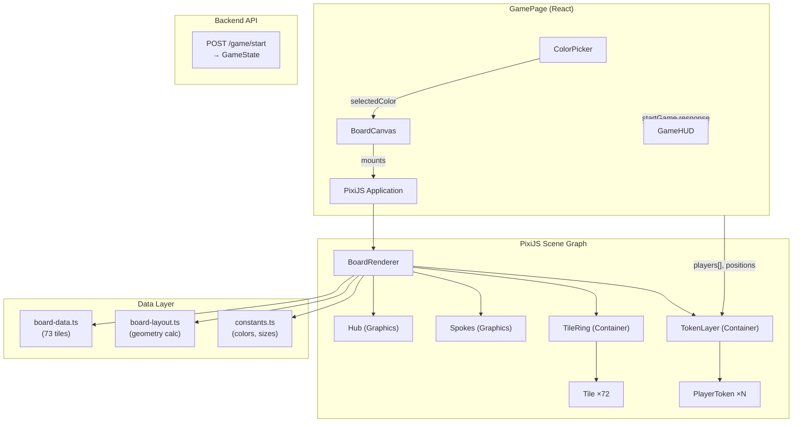
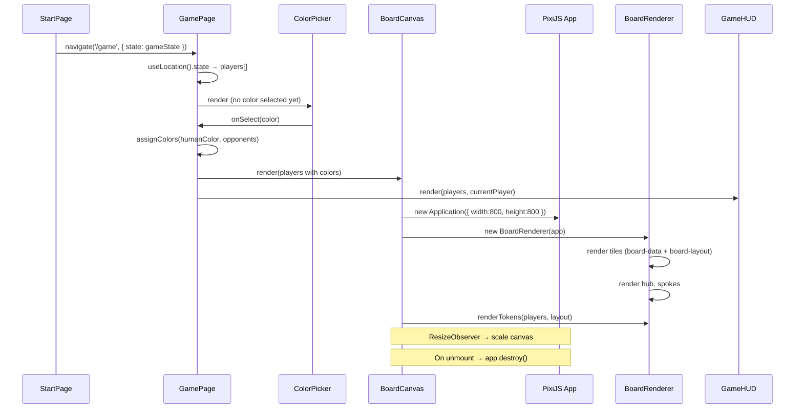

# MVP-3: Tabuleiro PixiJS — Design

**Spec**: `.specs/features/tabuleiro-pixijs/spec.md`
**Status**: Draft

---

## Architecture Overview

O tabuleiro PixiJS é renderizado em um canvas WebGL montado dentro da `GamePage` React. A integração usa `useRef` + `useEffect` (sem wrapper library) para controle total do ciclo de vida. O fluxo da GamePage é: **seleção de cor → renderização do tabuleiro + HUD**.

Os dados de tiles (73 posições) são definidos localmente no frontend, espelhando `board.config.ts` do backend (decisão AD-007). A cor do jogador é estado local React (decisão AD-008). PixiJS é dependência direta sem wrapper (decisão AD-009).



### Fluxo Principal

1. Player navega para `/game` após `POST /game/start` (StartPage existente)
2. GamePage exibe `ColorPicker` — jogador seleciona 1 de 6 cores
3. Sistema atribui cores distintas aos oponentes automaticamente
4. GamePage renderiza `BoardCanvas` (PixiJS) + `GameHUD` (React)
5. PixiJS canvas monta: hub central → anel de 72 tiles → 6 spokes → tokens no hub
6. Ao navegar para fora, `useEffect` cleanup destrói PixiJS Application e libera WebGL
7. Resize handler reescala canvas proporcionalmente ao container

---

## Code Reuse Analysis

### Existing Components to Leverage

| Component | Location | How to Use |
| --- | --- | --- |
| `auth.ts` helpers | `frontend/src/services/auth.ts` | `getNickname()` para HUD |
| `api.ts` Axios | `frontend/src/services/api.ts` | Futura integração API (MVP-4); neste MVP, game state vem do StartPage redirect |
| GamePage placeholder | `frontend/src/pages/GamePage.tsx` | Substituir conteúdo com lógica de seleção de cor + board canvas |
| Tailwind classes | Projeto-wide | HUD e ColorPicker usam Tailwind (consistente com Login/Start) |
| Backend tile data | `backend/src/game/board.config.ts` | Espelhar `buildTiles()` como constante local no frontend |
| Backend enums | `backend/src/common/enums/` | Espelhar `TileType`, `Category` como string unions TypeScript |

### Integration Points

| System | Integration Method |
| --- | --- |
| React lifecycle | `useRef` para container div, `useEffect` para mount/unmount PixiJS App |
| Backend game state | GameState retornado pelo `POST /game/start` (já feito no StartPage, precisa ser passado para GamePage) |
| Browser resize | `ResizeObserver` no container div → atualiza PixiJS renderer scale |
| WebGL availability | Try/catch na criação do PixiJS Application → fallback message |

### Key Integration Change: Passing Game State to GamePage

O StartPage atual faz `POST /game/start` e navega para `/game` sem passar o response. Este MVP precisa do game state (players, positions) para renderizar tokens. Solução: armazenar game state via React Router `navigate('/game', { state: gameState })` e ler com `useLocation()` na GamePage.

---

## Components

### GamePage (refactored)

- **Purpose**: Orquestra fluxo: redirect se sem game state → seleção de cor → board + HUD
- **Location**: `frontend/src/pages/GamePage.tsx`
- **Interfaces**:
  - State: `selectedColor: PlayerColor | null`, `colorAssignments: Map<string, PlayerColor>`
  - Reads: `useLocation().state` para game state (players, gameId)
  - Reads: `getNickname()` para identificar jogador humano
  - Renders: `ColorPicker` se `selectedColor === null`, senão `BoardCanvas + GameHUD`
  - Se `location.state` é null → `<Navigate to="/start" />`
- **Dependencies**: `auth.ts`, `react-router-dom`, `ColorPicker`, `BoardCanvas`, `GameHUD`
- **Reuses**: `getNickname()` do auth.ts existente

### ColorPicker

- **Purpose**: Tela de seleção de cor do token antes do tabuleiro aparecer
- **Location**: `frontend/src/components/ColorPicker.tsx`
- **Interfaces**:
  - Props: `onSelect(color: PlayerColor): void`
  - Renders 6 botões coloridos (um por cor disponível), clique dispara `onSelect`
  - Cores: red, blue, green, yellow, purple, orange (cores de tokens, não de categorias)
- **Dependencies**: `constants.ts` (para lista de cores)
- **Reuses**: Tailwind para estilo, mesmo padrão visual de LoginPage/StartPage

### BoardCanvas

- **Purpose**: Container React que monta/desmonta PixiJS Application e orquestra renderização
- **Location**: `frontend/src/components/BoardCanvas.tsx`
- **Interfaces**:
  - Props: `players: PlayerToken[]` (nickname, position, color, isHuman)
  - `useRef<HTMLDivElement>` para container do canvas
  - `useEffect` mount: cria PixiJS Application, instancia BoardRenderer, renderiza board + tokens
  - `useEffect` cleanup: destroi PixiJS Application (`app.destroy(true, { children: true })`)
  - `ResizeObserver`: observa container, atualiza escala do canvas
  - WebGL fallback: try/catch no init, renderiza mensagem de erro se falhar
- **Dependencies**: `pixi.js`, `BoardRenderer`, `board-data.ts`, `board-layout.ts`
- **Reuses**: Nenhum (novo)

### GameHUD

- **Purpose**: Painel lateral/overlay com informações mínimas do jogo
- **Location**: `frontend/src/components/GameHUD.tsx`
- **Interfaces**:
  - Props: `players: PlayerToken[]`, `currentPlayerNickname: string`, `humanNickname: string`
  - Renders: lista de jogadores (nickname + cor), indicador de turno atual, nickname do humano
- **Dependencies**: `constants.ts` (cores)
- **Reuses**: Tailwind classes (consistente com estilo existente)

### BoardRenderer (PixiJS class)

- **Purpose**: Classe pura PixiJS que cria o scene graph completo do tabuleiro
- **Location**: `frontend/src/game/pixi/BoardRenderer.ts`
- **Interfaces**:
  - `constructor(app: Application)` — recebe PixiJS application
  - `render(tiles: TileDef[], layout: BoardLayout): void` — renderiza hub + anel + spokes
  - `renderTokens(players: PlayerToken[], layout: BoardLayout): void` — renderiza tokens
  - `updateTokenPosition(nickname: string, position: number): void` — move token (futuro MVP-4)
  - `destroy(): void` — limpa containers
- **Dependencies**: `pixi.js`, `TileDef`, `BoardLayout`, `PlayerToken` types
- **Reuses**: Nenhum (novo)

---

## Data Models

### Frontend Type Definitions (`frontend/src/game/types.ts`)

```typescript
// Espelho dos enums do backend (string unions em vez de enums para simplicidade)
type TileType = 'hub' | 'category' | 'hq' | 'rollAgain';
type Category = 'geography' | 'entertainment' | 'history' | 'art' | 'science' | 'sports';

// Definição estática de tile (espelha backend Tile interface)
interface TileDef {
  position: number;
  type: TileType;
  category: Category | null;
}

// Cores de tokens dos jogadores (distintas das cores de categorias)
type PlayerColor = 'red' | 'blue' | 'green' | 'yellow' | 'purple' | 'orange';

// Token de jogador para renderização
interface PlayerToken {
  nickname: string;
  position: number;        // tile position (0-72)
  color: PlayerColor;
  isHuman: boolean;
}

// Layout geométrico calculado para renderização
interface TileLayout {
  position: number;        // tile index
  x: number;               // pixel X no canvas
  y: number;               // pixel Y no canvas
}

// Resultado do cálculo de layout do board inteiro
interface BoardLayout {
  centerX: number;
  centerY: number;
  ringRadius: number;      // raio do anel circular
  tileRadius: number;      // raio visual de cada tile
  hubRadius: number;       // raio do hub hexagonal
  tiles: TileLayout[];     // 73 posições (0=hub, 1-72=ring)
}
```

**Relationships**: `TileDef[]` é a definição estática (dados), `BoardLayout` é a geometria calculada (renderização). `PlayerToken` combina dados do `GameState.players[]` com cor atribuída localmente.

### Board Data (`frontend/src/game/board-data.ts`)

```typescript
// Constante estática espelhando backend/src/game/board.config.ts buildTiles()
// 73 tiles: position 0 = hub, positions 1-72 = circular track

const CATEGORY_CYCLE: Category[] = [
  'geography', 'entertainment', 'history', 'art', 'science', 'sports'
];

const HQ_POSITIONS: Record<number, Category> = {
  5: 'geography', 10: 'entertainment', 15: 'history',
  20: 'art', 25: 'science', 30: 'sports'
};

const ROLL_AGAIN_POSITIONS = new Set([
  3, 9, 14, 19, 24, 29, 35, 41, 47, 53, 59, 65
]);

export const BOARD_TILES: TileDef[] = buildTiles(); // mesma lógica do backend
```

---

## Board Rendering Algorithm

### Geometria do Tabuleiro

O tabuleiro clássico do Trivial Pursuit é um anel circular com hub central hexagonal e 6 raios (spokes). A renderização segue um sistema de coordenadas polares:

```
Canvas lógico: 800×800 pixels (escalado ao container)
Centro: (400, 400)
Raio do anel: 320px (distância do centro ao centro dos tiles)
Raio do hub: 60px
Raio de cada tile: 14px (circle) / 16px (HQ tiles, maiores)
```

### Cálculo de Posições dos Tiles (Ring)

72 tiles uniformemente distribuídos em um círculo. Cada tile ocupa um arco de 5° (360°/72):

```typescript
function calculateTilePosition(tileIndex: number, ringRadius: number, center: Point): Point {
  // tileIndex: 1-72 (posições do anel)
  // Ângulo começa no topo (-π/2) e progride no sentido horário
  const angleStep = (2 * Math.PI) / 72;
  const angle = -Math.PI / 2 + (tileIndex - 1) * angleStep;
  return {
    x: center.x + ringRadius * Math.cos(angle),
    y: center.y + ringRadius * Math.sin(angle),
  };
}
```

### Renderização por Camadas (z-order)

```
Camada 0 (fundo):     Background circular (disco cinza escuro)
Camada 1:             Spokes (6 linhas do hub até os HQs)
Camada 2:             Hub central (hexágono)
Camada 3:             Tiles do anel (72 círculos coloridos)
Camada 4 (topo):      Tokens dos jogadores
```

### Spokes (Raios)

6 linhas retas do centro do hub até cada posição HQ no anel:

```typescript
const HQ_TILE_POSITIONS = [5, 10, 15, 20, 25, 30];
// Para cada HQ: desenhar linha de (centerX, centerY) até tile[hqPos].position
```

### Hub Central

Hexágono desenhado com `Graphics.poly()` no centro do canvas. Cor distinta (branco/cinza claro) com borda.

### Cores de Tiles por Categoria

| Category | Hex Color | Cor Visual |
| --- | --- | --- |
| Geography | `#4FC3F7` | Azul claro |
| Entertainment | `#F48FB1` | Rosa |
| History | `#FFF176` | Amarelo |
| Art | `#CE93D8` | Roxo/Lilás |
| Science | `#81C784` | Verde |
| Sports | `#FFB74D` | Laranja |

### Indicadores Visuais Especiais

| Tile Type | Visual |
| --- | --- |
| HQ | Raio 20% maior que tile normal + borda dourada (2px) + estrela/diamante ícone |
| Roll Again | Tile normal com ícone de seta circular (🔄) ou padrão listrado |
| Hub | Hexágono branco/cinza com borda escura |

### Tokens dos Jogadores

- Cada token é um círculo (~12px raio) com a cor `PlayerColor`
- Token do humano: borda branca extra (2px) para distinguir
- Quando múltiplos tokens estão no mesmo tile, offset radial:
  - 1 token: centro do tile
  - 2 tokens: offset ±6px horizontal
  - 3 tokens: triângulo equilátero (offsets de 120°)
  - 4+ tokens: distribuição circular com raio 8px ao redor do centro

---

## Responsividade e Escalonamento

### Estratégia: Canvas lógico fixo + escala CSS

1. PixiJS Application criada com resolução lógica fixa: **800×800**
2. O canvas é inserido em um container `div` com `aspect-ratio: 1`
3. `ResizeObserver` monitora o container e aplica CSS transform scale
4. O canvas nunca redesenha ao redimensionar — apenas escala (performance)

```typescript
// Pseudo-código do resize handler
const scale = Math.min(containerWidth / 800, containerHeight / 800);
canvas.style.transform = `scale(${scale})`;
canvas.style.transformOrigin = 'top left';
```

### Layout da Página

```
┌──────────────────────────────────────────┐
│ GamePage (flex row)                       │
│ ┌────────────────────────┬──────────────┐ │
│ │                        │   GameHUD    │ │
│ │      BoardCanvas       │  ─────────  │ │
│ │    (PixiJS 800×800)    │  Players    │ │
│ │                        │  Current    │ │
│ │                        │  Legend     │ │
│ └────────────────────────┴──────────────┘ │
└──────────────────────────────────────────┘
```

- Board ocupa ~75% da largura, HUD ~25%
- Mínimo: 1280×720 (conforme spec)
- Abaixo de 800px width: board ainda renderiza mas pode ficar apertado

---

## File Structure

```
frontend/src/
├── pages/
│   └── GamePage.tsx              # REFACTOR: orquestra cor → board + HUD
├── components/
│   ├── ProtectedRoute.tsx        # existente
│   ├── ColorPicker.tsx           # NEW: seleção de cor pré-jogo
│   ├── BoardCanvas.tsx           # NEW: container React → PixiJS canvas
│   └── GameHUD.tsx               # NEW: painel lateral com info do jogo
├── game/
│   ├── types.ts                  # NEW: TileDef, PlayerToken, BoardLayout, etc.
│   ├── constants.ts              # NEW: CATEGORY_COLORS, PLAYER_COLORS, sizes
│   ├── board-data.ts             # NEW: 73 tiles estáticos (espelho backend)
│   ├── board-layout.ts           # NEW: calculateBoardLayout(canvasSize) → BoardLayout
│   └── pixi/
│       ├── usePixiApp.ts         # NEW: hook React para lifecycle PixiJS
│       ├── BoardRenderer.ts      # NEW: renderiza hub + tiles + spokes
│       └── TokenRenderer.ts      # NEW: renderiza/posiciona tokens dos jogadores
├── services/
│   ├── api.ts                    # existente
│   └── auth.ts                   # existente
```

Total de arquivos novos: **10**
Arquivos modificados: **2** (GamePage.tsx refactored, StartPage.tsx para passar state)

---

## Component Interaction Flow



---

## State Management

### GamePage State

```typescript
// GamePage internal state (useState)
const [selectedColor, setSelectedColor] = useState<PlayerColor | null>(null);
const [colorAssignments, setColorAssignments] = useState<Map<string, PlayerColor>>(new Map());

// Derived from route state
const location = useLocation();
const gameState = location.state as GameStateFromAPI | null;
```

No global state management needed (AD-004). Color selection and assignments are local to GamePage. Game state arrives via React Router location state.

### Color Assignment Algorithm

```typescript
function assignColors(humanColor: PlayerColor, players: Player[]): Map<string, PlayerColor> {
  const allColors: PlayerColor[] = ['red', 'blue', 'green', 'yellow', 'purple', 'orange'];
  const available = allColors.filter(c => c !== humanColor);
  const assignments = new Map<string, PlayerColor>();

  players.forEach(player => {
    if (player.isHuman) {
      assignments.set(player.nickname, humanColor);
    } else {
      assignments.set(player.nickname, available.shift()!);
    }
  });

  return assignments;
}
```

---

## WebGL Fallback

```typescript
// Inside BoardCanvas useEffect
try {
  const app = new Application();
  await app.init({ width: 800, height: 800, background: '#1a1a2e' });
  containerRef.current.appendChild(app.canvas);
} catch (error) {
  setWebGLError(true);
  // Render: "Seu navegador não suporta WebGL. Use Chrome ou Firefox atualizados."
}
```

---

## Error Handling Strategy

| Error Scenario | Handling | User Impact |
| --- | --- | --- |
| WebGL not available | try/catch on PixiJS init | Mensagem "Navegador não suporta WebGL" |
| No game state (direct /game nav) | Check `location.state` → redirect | Redirect para `/start` |
| PixiJS init failure | try/catch, set error state | Mensagem fallback, board não renderiza |
| Window too small (<800px) | Board scales down via CSS | Board legível mas apertado |
| Multiple tokens same tile | Offset algorithm | Tokens separados visualmente |

---

## Tech Decisions

| Decision | Choice | Rationale |
| --- | --- | --- |
| PixiJS version | v8.x (latest) | Current stable, modern API with `app.init()` async |
| Canvas logical size | 800×800 fixed | Simplifica cálculos; resize via CSS scale, não re-render |
| Tile shape | Circles (Graphics.circle) | Mais simples que hexágonos; visualmente OK para board game |
| Token shape | Circles with color fill | Simples e distinto; borda branca extra para humano |
| HQ indicator | Larger radius + gold border | Visualmente distinto sem precisar de sprites/assets |
| Roll Again indicator | Striped pattern (alternating alpha) | Sutil mas visível; sem necessidade de ícones externos |
| Game state passing | React Router location state | Evita estado global e re-fetch desnecessário |
| Spoke rendering | Simple lines (Graphics.moveTo/lineTo) | Fiel ao layout clássico, zero complexity |
| Hub shape | Hexágono via polygon | Clássico Trivial Pursuit, 6 lados = 6 categorias |
| Resize strategy | CSS transform scale | Zero re-render PixiJS; máxima performance |
| Player colors vs Category colors | Paletas separadas | Cores de tokens (red, blue...) são distintas das cores de categorias (geography=azul) para evitar confusão |
