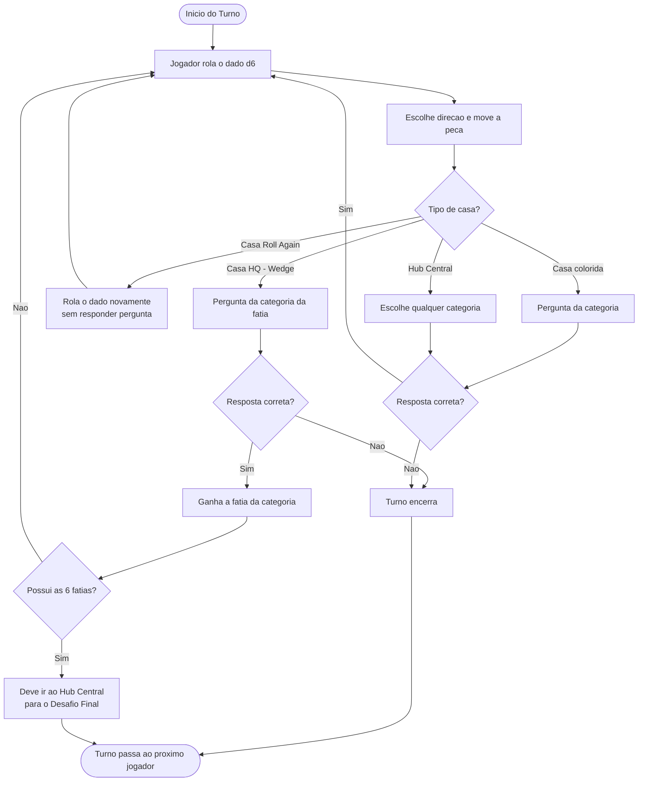
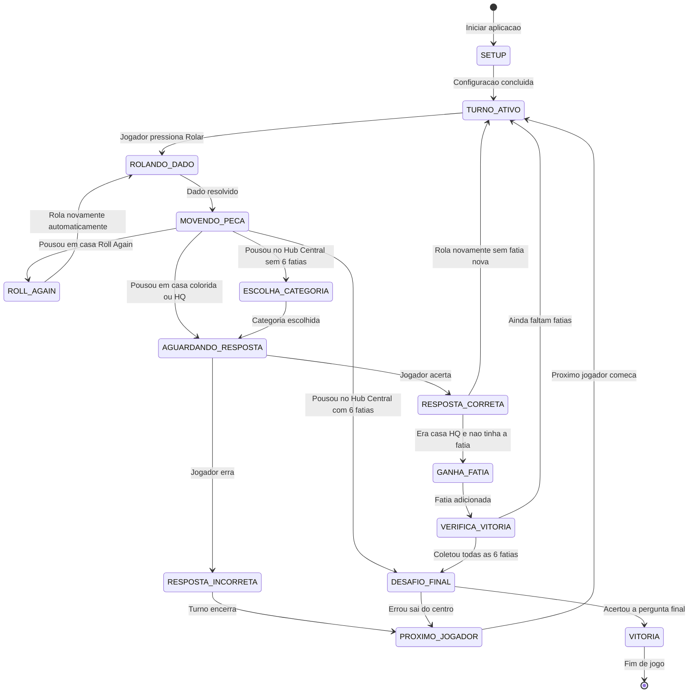
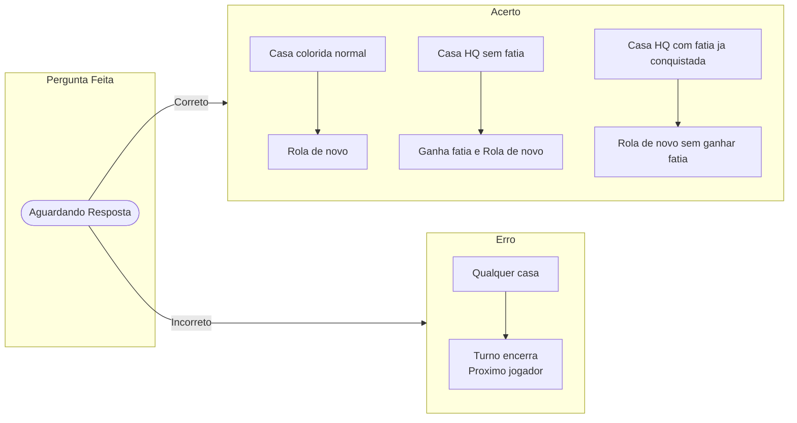
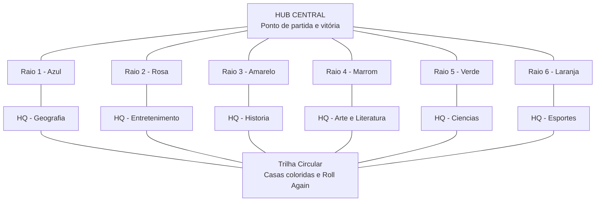
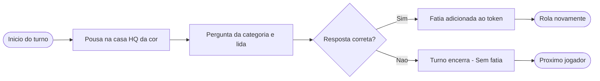
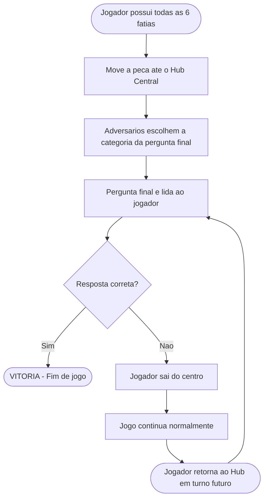

# 🎲 Trivial Pursuit — Documentação de Mecânicas para Versão Digital

> **Referência:** Hasbro Official Rules — Versão Clássica (Genus Edition)  
> **Gerado em:** 2026-03-29

---

## Índice

1. [Visão Geral do Jogo](#1-visão-geral-do-jogo)
2. [Configuração Inicial](#2-configuração-inicial)
3. [Categorias de Perguntas](#3-categorias-de-perguntas)
4. [Fluxo de uma Rodada](#4-fluxo-de-uma-rodada-turn-flow)
5. [Estados do Jogo](#5-estados-do-jogo-game-states)
6. [Casas Especiais do Tabuleiro](#6-casas-especiais-do-tabuleiro)
7. [Sistema de Pontuação e Progresso](#7-sistema-de-pontuação-e-progresso)
8. [Condição de Vitória e Fim de Jogo](#8-condição-de-vitória-e-fim-de-jogo)
9. [Apêndice: Referência Rápida](#apêndice-referência-rápida-para-implementação-digital)

---

## 1. Visão Geral do Jogo

**Trivial Pursuit** é um jogo de tabuleiro de perguntas e respostas criado por Scott Abbott e Chris Haney em **1979**, lançado comercialmente em **1982**. É considerado o jogo de trivia mais popular de todos os tempos, com mais de 100 milhões de cópias vendidas em mais de 26 países.

### Conceito Central

Os jogadores percorrem um tabuleiro circular respondendo perguntas de trivia em seis categorias temáticas distintas. O objetivo é conquistar uma **fatia de torta (wedge)** em cada uma das seis categorias e, em seguida, retornar ao centro do tabuleiro para responder corretamente a uma **pergunta final**, vencendo assim o jogo.

### Informações Gerais

| Parâmetro               | Detalhe                                                                |
| ----------------------- | ---------------------------------------------------------------------- |
| **Objetivo**            | Colecionar as 6 fatias de torta e responder à pergunta final no centro |
| **Público-alvo**        | Adolescentes e adultos (16+ anos na edição clássica)                   |
| **Número de jogadores** | 2 a 6 individuais, ou times de qualquer tamanho                        |
| **Duração média**       | 60 a 90 minutos                                                        |
| **Complexidade**        | Baixa (regras simples, mas conhecimento amplo exigido)                 |

---

## 2. Configuração Inicial

### 2.1 Número de Jogadores

- **Mínimo:** 2 jogadores individuais
- **Máximo:** 6 jogadores individuais
- **Em equipes:** sem limite fixo (ex: 36 pessoas divididas em 6 equipes de 6)
- **Solo:** tecnicamente possível, mas não é a proposta oficial do jogo

### 2.2 Componentes Físicos

| Componente               | Quantidade | Detalhes                                                                                 |
| ------------------------ | ---------- | ---------------------------------------------------------------------------------------- |
| **Tabuleiro**            | 1          | Formato circular com trilha de casas coloridas, 6 raios (spokes) e hub central hexagonal |
| **Peças (tokens)**       | 6          | Formato de torta, cada uma com 6 compartimentos para guardar as fatias                   |
| **Fatias (wedges)**      | 36         | 6 por categoria (6 cores x 6 = 36 fatias no total)                                       |
| **Cartões de perguntas** | 400        | Cada cartão possui 6 perguntas (uma por categoria) — ~2.400 perguntas no total           |
| **Suportes de cartões**  | 6          | Caixinhas que organizam os cartões no tabuleiro                                          |
| **Dado**                 | 1          | Dado de 6 faces padrão (d6)                                                              |

### 2.3 Montagem do Jogo

1. Desdobrar o tabuleiro sobre uma superfície plana.
2. Posicionar os suportes de cartões nos locais indicados no tabuleiro.
3. Embaralhar as cartas de perguntas e colocá-las nos suportes.
4. Cada jogador escolhe uma peça (token/torta) e a posiciona no **hub central**.
5. Separar as fatias (wedges) por cor e deixá-las acessíveis a todos.
6. Determinar quem começa primeiro.

### 2.4 Quem Começa Primeiro

Não há uma regra única obrigatória. As opções aceitas oficialmente são:

- **Maior resultado no dado:** cada jogador lança o dado, quem tirar o maior número começa.
- **Sorteio aleatório:** qualquer método acordado entre os jogadores.
- **Consenso do grupo:** o jogador com reputação de maior conhecimento geral começa.

> Após o primeiro jogador, o turno avança sempre no **sentido horário**.

---

## 3. Categorias de Perguntas

O Trivial Pursuit clássico possui exatamente **6 categorias**, cada uma representada por uma cor específica no tabuleiro e nas fatias de torta.

| Cor         | Categoria               | O que abrange                                                                                              |
| ----------- | ----------------------- | ---------------------------------------------------------------------------------------------------------- |
| Azul        | **Geografia**           | Capitais, países, oceanos, montanhas, rios, regiões geográficas, mapas, fronteiras e fenômenos naturais    |
| Rosa        | **Entretenimento**      | Cinema, televisão, música, celebridades, teatro, jogos, quadrinhos, rádio e cultura pop                    |
| Amarelo     | **História**            | Eventos históricos mundiais, guerras, revoluções, datas importantes, líderes e civilizações antigas        |
| Marrom/Roxo | **Arte e Literatura**   | Pinturas, esculturas, escritores, poetas, obras literárias, arquitetura, filosofia e expressões artísticas |
| Verde       | **Ciências e Natureza** | Biologia, física, química, astronomia, medicina, matemática, tecnologia e ecologia                         |
| Laranja     | **Esportes e Lazer**    | Esportes de todas as modalidades, atletas, olimpíadas, jogos, hobbies e atividades de lazer                |

> **Nota de implementação:** em versões temáticas (Harry Potter, anos 80 etc.), as categorias podem ser substituídas por equivalentes temáticos, mas o número de **6 categorias** é sempre mantido.

---

## 4. Fluxo de uma Rodada (Turn Flow)

### 4.1 Sequência de Ações por Turno

| Passo | Ação                                                                                                                                                                                               |
| ----- | -------------------------------------------------------------------------------------------------------------------------------------------------------------------------------------------------- |
| **1** | **Rolar o dado** — O jogador ativo lança o d6 e obtém um valor de 1 a 6.                                                                                                                           |
| **2** | **Mover a peça** — O jogador move sua peça o número exato de casas indicado. Pode escolher a direção (horário ou anti-horário) e os raios (spokes), mas não pode mudar de direção na mesma jogada. |
| **3** | **Identificar a casa** — Ao parar, o jogador verifica o tipo e a cor da casa onde pousou.                                                                                                          |
| **4** | **Responder a pergunta** — O jogador à esquerda do ativo lê a questão correspondente à cor da casa.                                                                                                |
| **5** | **Acerto ou Erro** — O resultado determina o que acontece a seguir.                                                                                                                                |
| **6** | **Próximo jogador** — Após o fim do turno, o jogo passa ao jogador à esquerda.                                                                                                                     |

### 4.2 Diagrama do Fluxo de Turno

### 4.3 Acertar ou Errar uma Pergunta

**Se a resposta for CORRETA:**

- O jogador rola o dado novamente e continua o turno.
- Se estiver em uma **casa HQ** da cor correspondente: ganha a fatia e adiciona ao seu token.
- O turno continua enquanto o jogador acerta.

**Se a resposta for INCORRETA:**

- O turno termina **imediatamente**.
- O jogador **não perde** nenhuma fatia já conquistada.
- O jogo passa para o próximo jogador (à esquerda).

### 4.4 Regras de Movimento

- O dado é um **d6** (valores de 1 a 6).
- O jogador deve mover **exatamente** o número de casas rolado — não pode mover menos.
- A direção e o caminho são escolhidos **estrategicamente** a cada turno.
- Nos raios (spokes), o hub central conta como **uma casa**.
- Não é possível **mudar de sentido** (horário/anti-horário) durante o mesmo movimento.
- Múltiplos jogadores podem ocupar a **mesma casa** sem penalidades.

---

## 5. Estados do Jogo (Game States)

### 5.1 Diagrama Geral de Estados

### 5.2 Diagrama de Transições de Resposta

### 5.3 Detalhamento de Cada Estado

#### `SETUP` — Configuração Inicial

Tela de início da partida. O jogador configura nomes, avatares, modo de jogo (individual ou equipes), edição de perguntas e ordem inicial (rolagem de dado virtual ou aleatório).

#### `TURNO_ATIVO` — Turno do Jogador

Estado principal do jogo. O jogador ativo visualiza o tabuleiro, seu token e suas fatias. Aguarda o input de "Rolar Dado".

#### `ROLANDO_DADO` — Animação de Dado

O dado é lançado virtualmente. Um valor de 1 a 6 é gerado e exibido com animação.

#### `MOVENDO_PECA` — Seleção de Destino

O sistema calcula todos os destinos possíveis com o valor rolado e exibe as opções navegáveis. O jogador seleciona o caminho e a casa de destino.

#### `ROLL_AGAIN` — Jogar Novamente

O jogador pousou em uma casa especial de "Role Novamente". Nenhuma pergunta é feita. O sistema rola o dado automaticamente e reinicia o movimento.

#### `AGUARDANDO_RESPOSTA` — Pergunta Exibida

Uma pergunta da categoria correspondente à casa é exibida. O timer (se configurado) começa. O jogador seleciona ou digita sua resposta.

#### `RESPOSTA_CORRETA` — Acerto

Feedback visual e sonoro de acerto. Se for casa HQ sem a fatia correspondente, o estado transita para `GANHA_FATIA`. Caso contrário, o jogador pode rolar novamente.

#### `RESPOSTA_INCORRETA` — Erro

Feedback visual e sonoro de erro. A resposta correta é brevemente revelada. O turno encerra e o controle passa ao próximo jogador.

#### `GANHA_FATIA` — Wedge Conquistado

A fatia da categoria é animada e inserida no token do jogador. O sistema verifica se o jogador agora possui as 6 fatias.

#### `VERIFICA_VITORIA` — Checagem de Condição de Vitória

Verificação automática: se o jogador tem as 6 fatias e está no hub central, transita para `DESAFIO_FINAL`. Caso contrário, retorna para `TURNO_ATIVO`.

#### `ESCOLHA_CATEGORIA` — Adversário Escolhe Categoria

Ativado quando um jogador completo (6 fatias) pousa no hub central. Um adversário (ou o sistema, aleatoriamente) seleciona a categoria da pergunta final.

#### `DESAFIO_FINAL` — Pergunta Final no Centro

O jogador enfrenta a pergunta final no hub central. Se acertar, vence. Se errar, deve sair do centro e tentar novamente em turno futuro.

#### `PROXIMO_JOGADOR` — Transição de Turno

Estado de transição. O sistema destaca o próximo jogador (sentido horário) e prepara o estado `TURNO_ATIVO` para ele.

#### `VITORIA` — Fim de Jogo

Tela de vitória com animações, ranking de todos os jogadores por número de fatias e opções de jogar novamente ou encerrar.

---

## 6. Casas Especiais do Tabuleiro

### 6.1 Estrutura Geral do Tabuleiro

### 6.2 Tipos de Casas

| Tipo de Casa          | Nome técnico                 | Qtd | Efeito                                                                       |
| --------------------- | ---------------------------- | --- | ---------------------------------------------------------------------------- |
| **Casa Colorida**     | _Category Space_             | ~36 | Pergunta da cor correspondente. Acerto = rola de novo. Não dá fatia.         |
| **Casa de Categoria** | _Headquarters / Wedge Space_ | 6   | Igual à casa colorida, mas acerto = **ganha a fatia** da cor.                |
| **Casa Coringa**      | _Roll Again_                 | 12  | Rola o dado imediatamente de novo, sem perguntas.                            |
| **Hub Central**       | _Center Hub_                 | 1   | No jogo normal: escolhe qualquer categoria. Com 6 fatias: **Desafio Final**. |

> **Nota:** As 6 casas HQ ficam posicionadas ao final de cada raio. Cada uma tem uma cor específica correspondente a uma das seis categorias.

---

## 7. Sistema de Pontuação e Progresso

### 7.1 As Fatias de Torta (Wedges)

As fatias de torta (também chamadas de _queijos_ ou _pies_) são o principal mecanismo de progresso do jogo. Cada fatia representa o domínio do jogador em uma categoria.

- Há **6 categorias** → 6 fatias diferentes para coletar.
- Cada fatia tem uma **cor correspondente** à sua categoria.
- As fatias são inseridas nos compartimentos do token, preenchendo visualmente a "torta".
- Um jogador **não pode ter mais de uma fatia da mesma cor**.

### 7.2 Como Conquistar uma Fatia

1. O jogador deve pousar **exatamente** em uma casa HQ — o ponto especial ao final de cada raio.
2. Uma pergunta da categoria correspondente é lida.
3. O jogador deve responder **corretamente**.
4. A fatia é adicionada ao seu token.

> **Importante:** Se um jogador pousa em uma casa HQ que **já possui a fatia** correspondente, o turno segue normalmente — pode rolar de novo por acertar, mas não ganha outra fatia.

### 7.3 Quantidade Necessária para Vencer

| Condição                | Detalhe                                                                  |
| ----------------------- | ------------------------------------------------------------------------ |
| **Fatias necessárias**  | 6 fatias de cores diferentes (uma de cada categoria)                     |
| **Após coletar as 6**   | Deve navegar até o hub central e responder corretamente à pergunta final |
| **Fatias já coletadas** | Nunca são perdidas, mesmo ao errar perguntas                             |

---

## 8. Condição de Vitória e Fim de Jogo

### 8.1 Como o Jogo Termina

O jogo termina **imediatamente** quando um jogador:

1. Possui as **6 fatias** de torta (uma de cada cor/categoria).
2. Chega ao **hub central** com seu turno.
3. Responde corretamente à **pergunta do Desafio Final**.

### 8.2 Diagrama do Desafio Final

### 8.3 Regras do Desafio Final

1. O jogador com todas as 6 fatias move sua peça até o **hub central**.
2. Os adversários (ou um adversário escolhido) **selecionam a categoria** da pergunta final — geralmente a mais fraca do jogador.
3. A pergunta é lida ao jogador ativo.
4. Se **acertar** → vence o jogo **imediatamente**.
5. Se **errar** → deve mover sua peça para fora do hub. O jogo continua e o jogador precisará retornar ao centro em turno futuro para tentar novamente.

### 8.4 Empate

O Trivial Pursuit **não possui mecanismo de empate** na versão clássica:

- Apenas um jogador pode responder a pergunta final por turno.
- O **primeiro** a responder corretamente à pergunta final vence, independentemente do progresso dos outros.
- Não existe vitória simultânea.

> **Disputas de respostas:** se uma resposta for contestada, a regra geral é consultar o verso do cartão. Na versão digital, a resposta do banco de dados é sempre **definitiva**.

---

## Apêndice: Referência Rápida para Implementação Digital

| Parâmetro                             | Valor / Comportamento                                       |
| ------------------------------------- | ----------------------------------------------------------- |
| **Jogadores**                         | 2 a 6 (individual) ou 2+ equipes                            |
| **Dado**                              | d6 — 1 dado, valores 1 a 6                                  |
| **Categorias**                        | 6 (Geo, Ent, Hist, Arte, Ciencias, Esportes)                |
| **Fatias necessárias**                | 6 (uma de cada categoria)                                   |
| **Casas Roll Again**                  | 12 na trilha circular                                       |
| **Casas HQ (fatia)**                  | 6 (uma por categoria, ao final de cada raio)                |
| **Acerto = rolar de novo?**           | Sim — turno continua                                        |
| **Erro = perder fatia?**              | Nao — fatias conquistadas sao permanentes                   |
| **Desafio Final**                     | Adversario escolhe categoria; ocorre no centro do tabuleiro |
| **Empate possivel?**                  | Nao — apenas um vencedor                                    |
| **Direcao do movimento**              | Livre (horario/anti-horario), sem mudar na mesma jogada     |
| **Multiplos jogadores na mesma casa** | Permitido, sem penalidade                                   |
| **Hub central no jogo normal**        | Jogador escolhe qualquer categoria para a pergunta          |

---

_Documentacao elaborada com base nas regras oficiais Hasbro do Trivial Pursuit Edicao Classica (Genus Edition). Para versoes tematicas, consultar as regras especificas de cada edicao._
